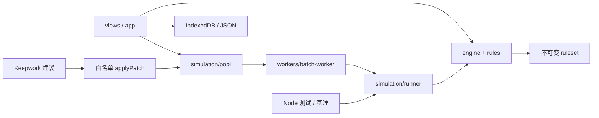

# 架构

参考 maisi `webgames/tools/AIChat/AGENTS.md` 的 HTML 入口 + 独立 CSS + 职责模块约定。应用不需要打包器；静态 HTTP 只负责分发文件。Node 和 Python 均不参与浏览器战斗运行。

| 模块 | 边界 |
|---|---|
| `js/app.js` | 加载版本、导航、配置导入导出，创建新对局 |
| `state.js` | 当前界面状态，绝不实现伤害等规则 |
| `storage.js` | IndexedDB records、文件下载；不存登录凭证 |
| `rules/character.js` | 属性编译与来源，配装和快照互斥 |
| `rules/formulas.js` | 双版本数学规则、常量、能量 |
| `engine/battle.js` | 阵营回合、抽牌、合法动作、确定性状态机、回放 |
| `engine/effects.js` | 状态、伤害/治疗/控制等效果执行 |
| `engine/coverage.js` | 明确可执行/阻止清单；可执行不等于原版对照通过 |
| `bots/strategy.js` | 仅从正常可见 observation 选合法动作 |
| `simulation/runner.js` | 场景采样、纯批量计算、聚合报告 |
| `simulation/pool.js` | 浏览器 Worker 调度、进度、取消；不写战斗规则 |
| `ai/` | 懒加载 SDK、结构化建议校验、候选及独立种子复测 |
| `render/arena.js` | Canvas 绘图与角色点击，不影响战斗状态 |

内核、规则、机器人不访问 DOM、网络、时钟或 Math.random。内核随机源为显式种子 PRNG，机器人使用另一条由种子/回合/角色派生的随机流，避免策略调用改变结算随机序列。这个 PRNG 不宣称与 Lua math.random 相同；公式对照与 JS 平台一致性是不同的验收项。

`createBattle` 创建独立状态并复制场景。`stepBattle` 先校验所有行动再修改状态。规则数据被视为只读；`applyPatch` 深拷贝产生新配置。Worker 各自持有结构化拷贝；调度顺序不影响每场 index 的种子，报告按 index 排序。AI 与普通实验共享单任务 UI 锁。

原始数据 hash 含输入文件哈希、加载顺序和转换器哈希；数值候选 hash 含父配置 hash 与精确补丁。战报另带引擎版本。发布规则变更须升级 ENGINE_VERSION，并重新记录基准与覆盖。运行时不自动修改正式服。
