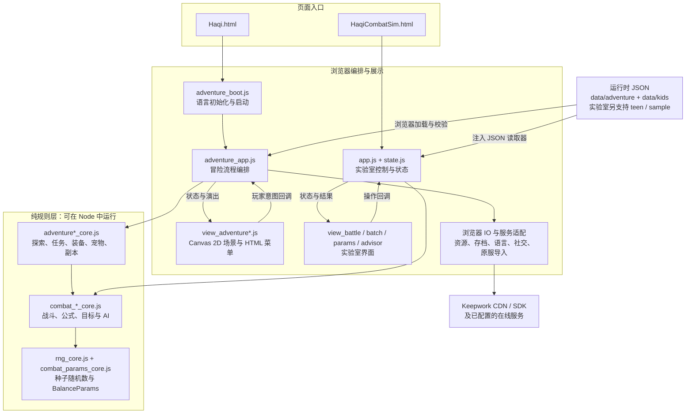
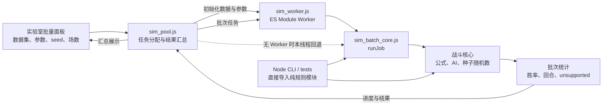
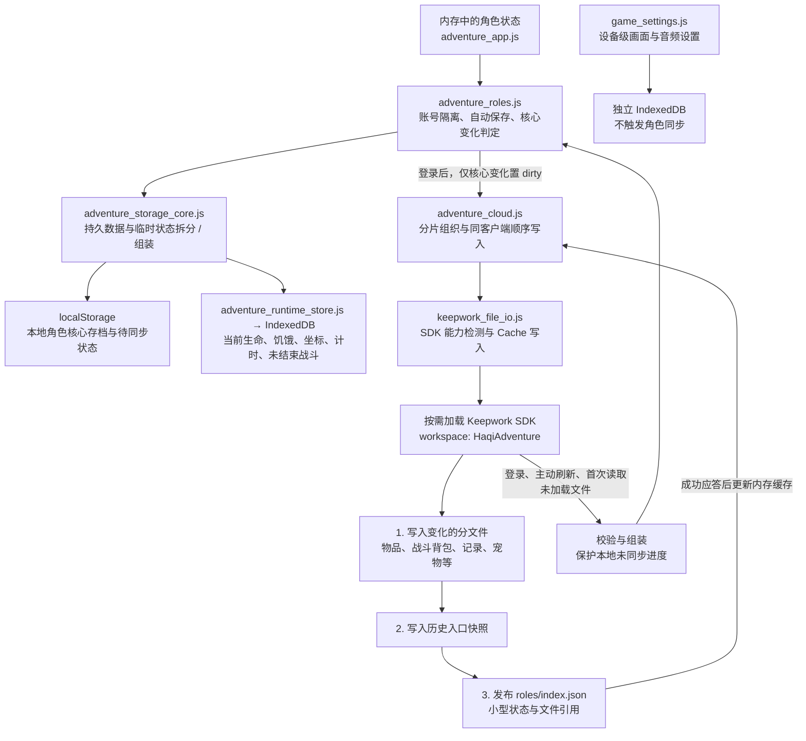

# 魔法哈奇 · Haqi

魔法哈奇的 2D 网页角色扮演游戏：在六座岛屿中探索、结识居民、完成任务，学习五系魔法，收集装备、培养宠物，与伙伴一起挑战副本和赛场。在冒险途中，还可以通过双语故事与语音交流学习语言。

**游戏主入口是 [Haqi.html](Haqi.html)。** 项目已从战斗模拟器发展为涵盖探索、成长、战斗、宠物、社交与语言学习的完整游戏。沿用的 `HaqiCombatSim/` 目录名和 npm 包名属于历史命名；原战斗模拟器保留为开发与数值验证工具。

本项目以原版魔法哈奇儿童版（kids）的内容与规则为基础，面向桌面和手机浏览器进行二维改编。以下介绍对应当前源码（2026-09-30）；实际线上版本以发布记录为准。

## 游戏内容

| 玩法 | 当前内容 |
| --- | --- |
| 世界探索 | 魔法营地、哈奇岛、火鸟岛、寒冰岛、沙漠岛、幽暗岛；世界地图、岛内导览、自动寻路、区域天气、居民与野外遭遇 |
| 任务与成长 | 营地教学、全岛任务手记、接取与交付、1–50 级成长、五系技能学习、NPC 商店与海上捕鱼 |
| 卡牌战斗 | 烈火、寒冰、风暴、生命、死亡五系；多套配卡、装备附卡、符文、目标选择、宠物出战与技能演出 |
| 装备与收藏 | 背包、独立装备实例、穿戴、强化、宝石镶嵌、属性预览与卡包管理 |
| 宠物与坐骑 | 抱抱龙与宠物收集、捕获、成长、编队、随行、骑乘、口粮与共享食槽，以及宠物互动、好友印记、繁育与领养 |
| 副本与试炼 | 原版副本内容、岛屿剧情秘境、试炼塔、多场连续战斗与首领挑战；支持宠物阵容和伙伴组队 |
| 岛屿伙伴与赛场 | 六岛伙伴漫游、交谈、招募、快照组队 PvE；红蘑菇赛场支持 1v1–4v4、宠物与伙伴备战、AI 战队对手 |
| 语言学习 | 界面语言、母语与目标语言独立选择；双语对白、示范朗读、提示、主动录音与剧情交流，当前教学内容以中英双向为主；可关闭学习或跳过剧情 |
| 角色与存档 | 多角色管理、本地自动存档、Keepwork 登录与云同步，以及原服装备和卡包的预览式导入 |

原版内容按网页版支持范围接入；任务目录收录不代表全部原服脚本都可执行。原服导入会说明转换差异，确认后创建独立角色，具体范围见 [原服角色导入](docs/player-import.md)。

组队使用伙伴快照与 AI 行动，红蘑菇当前对手为 AI 战队。真人实时联机、私聊、邮件和远端排行榜的开放状态应分别确认；当前配置尚未开启私聊与邮件服务，排行榜仍待独立 gameId。详见 [岛屿社交](docs/island-social.md) 和 [红蘑菇赛场](docs/red-mushroom-arena.md)。

## 本地运行

在本项目目录使用 Node.js 20.19.x 或更新的 20.x，或 Node.js 22.12+（推荐 24）：

```sh
npm ci
npm run dev
```

开发服务器会打开 `Haqi.html`。源码使用原生 ES Modules 和 Vanilla JS，也可以不安装构建工具，直接运行静态 HTTP 服务：

```sh
python -m http.server 8791 --bind 127.0.0.1
```

随后打开 [本地游戏入口](http://127.0.0.1:8791/Haqi.html)。需要 HTTP 服务读取 JSON 和加载模块，不能直接双击 HTML 使用 `file://` 运行。

- **默认资源：** 所有域名（包括 localhost）使用资源清单中的永久 Keepwork CDN 图片与音频，需要网络。
- **本地资源：** 源码静态服务可打开 `Haqi.html?assets=local`，使用仓库归档资源；此模式不适用于普通 H5 的 `dist/`。
- **账号服务：** 访客可使用本地角色与自动存档；云同步、原服读取和在线语言服务需要相应网络服务。Keepwork SDK 按需加载。

运行时数据已随仓库提供，正常游玩不需要原版客户端或重新导出数据。

## 存档与角色

访客与各 Keepwork 账号的角色相互隔离，每个作用域最多五个主角。标题页选择或新建角色；登录后可使用云端角色与跨设备进度。

云端保存成长、任务领取、物品、装备、卡包、宠物等核心数据，按变化拆分文件并复用未变化内容。当前生命、宠物饥饿与生命、位置、计时及未结束战斗保存在本机 IndexedDB；切换设备不会接续这些临时状态。网络失败保留本地待同步进度，恢复时校验存档并保护尚未同步的数据。

当前云同步采用单客户端写入模式。完整协议与恢复规则见 [用户存储](docs/user-storage.md)。游戏界面已移除旧的存档 JSON 导入／导出入口，原服角色导入是独立功能。

## 页面与开发工具

| 入口 | 用途 |
| --- | --- |
| [Haqi.html](Haqi.html) | 正式游戏：探索、任务、战斗、养成、组队与语言学习 |
| [HaqiOfficialWebsite.html](HaqiOfficialWebsite.html) | 多语言产品官网 |
| [HaqiPromo.html](HaqiPromo.html) | 宣传片放映室与录屏入口 |
| [HaqiCombatSim.html](HaqiCombatSim.html) | 战斗实验室：本地人机对战、批量胜率模拟、数值调参与 AI 建议 |
| [HaqiCards.html](HaqiCards.html) | 卡牌浏览与研究 |
| [HaqiEffects.html](HaqiEffects.html) | 技能特效工坊与时间轴预览 |
| [HaqiHeroPreview.html](HaqiHeroPreview.html) | 角色外观预览 |
| [HaqiImportTest.html](HaqiImportTest.html) | 原服角色读取诊断 |

战斗实验室保留 `#battle`、`#batch`、`#params`、`#advisor` 四个页面，以及 kids、teen、sample 数据集。面向玩家的新内容与翻译以 kids 为范围，teen 保留用于既有模拟与回归。

## 架构图

以下按当前源码（2026-10-01）展示主要模块与数据流，省略独立预览工具及部分玩法子模块。图中箭头表示启动、调用或数据传递，不是完整的 import 依赖图；GitHub 可直接渲染 Mermaid 图。

### 1. 游戏与实验室的分层



**分层边界：** 视图负责绘制和事件绑定，控制器协调玩法与 IO；核心规则不访问 DOM、网络或浏览器存储。冒险与实验室复用战斗规则，新增玩家内容以 kids 为范围。详见 [技术架构](docs/architecture.md) 与 [冒险系统](docs/adventure.md)。

### 2. 批量模拟与可复现验证



相同 seed、数据和参数用于重现模拟结果；BalanceParams 统一提供数值覆盖。Worker 将批量运算移出主线程，未支持卡牌效果必须进入统计，不静默忽略。公式来源见 [Lua 对照表](docs/lua-mapping.md)。

### 3. 本地存档与可选云同步



**存储边界：** 未变化分片复用已有引用；临时状态及设备设置不上传。云同步采用单客户端写入假设，不是多人实时状态服务器。SDK 支持时直接等待 Cache PUT 成功，否则兼容原 Cache 同步链路；失败、超时或身份变化不清除待同步状态。访客与网络失败时仍保留本地体验，详见 [用户存储](docs/user-storage.md)。

## 开发与验证

源码保持原生 JavaScript，Vite 用于开发与发布。战斗和玩法规则放在不依赖 DOM、网络或存储的 `js/*_core.js` 中，界面与 IO 单独分层；规则随机数使用可复现种子，数值覆盖统一通过 BalanceParams。

```sh
npm run test:battle       # 战斗相关修改的快速回归
npm test                 # 全量 Node 测试
npm run check:maps       # 地图源与生成数据一致性
npm run check:adventure  # 冒险内容及本地资源检查
npm run audit:effects    # 技能特效覆盖检查
```

日常按改动范围运行检查；战斗引擎、卡牌交互、AI、宠物／坐骑、状态、倒计时、结算及影响战斗的共享 UI 修改必须执行快速战斗回归。发布前按 [产品发布验收](docs/product-release-qa.md) 选择简单、核心或全部黑盒流程。验证记录见 [QA 报告](docs/qa-report.md)，开发过程记录在 `docs/devlog/`。

需要从本机原版 `config/Aries/` 刷新战斗数据，或在命令行运行数值实验时：

```sh
npm run export
npm run sim -- --data data/kids --mode 1v1 --games 1000 --level 50 --seed 1
```

数据导出依赖原版源码与配置目录，详见 [数据导出](docs/data-export.md)。战斗公式来源与 kids／teen 差异见 [Lua 对照表](docs/lua-mapping.md)。

## 构建与发布

```sh
npm run build           # H5 构建，输出 dist/
npm run preview         # 预览构建后的游戏
npm run plan:release    # 构建并生成发布计划，不上传
```

H5 发布包包含页面、脚本、样式及运行配置／词典，不重复打包图片和音频；美术通过独立资源流程上传至 Keepwork CDN。资源清单维护本地路径、CDN 地址、裁剪信息、来源和哈希。

正式发布使用 `npm run upload`，详细凭据、核验与入口同步流程见 [部署说明](docs/deployment.md)。**`upload` 和 `verify:release` 还会执行 apps 仓库入口同步、提交与推送，不是单纯的本地检查命令。** 只有明确需要发布时才运行。

项目也提供 Electron 桌面、Steam 文件暂存及 Capacitor Android／iOS 工程。`npm run build:app` 生成包含本地美术的 `app-dist/`；平台打包、签名与发行条件见同一部署文档。构建脚本可用不代表已在对应商店上线。

## 目录导航

```text
HaqiCombatSim/
  Haqi.html                 游戏入口
  HaqiCombatSim.html        战斗实验室入口
  js/                       启动、玩法核心、渲染、界面与 IO 模块
  css/                      游戏与工具页面样式
  config/maps/              六岛布局源与地图生成配置
  data/adventure/           任务、地图、副本、宠物、商店、资源清单与词典
  data/kids/                儿童版战斗数据
  data/teen/                既有青年版模拟数据
  data/sample/              示例与测试数据
  assets/                   本地资源归档
  scripts/                  导出、生成、资源准备、构建与验证工具
  tests/                    规则回归与隔离验收页面
  shell/                    桌面应用外壳
  android/  ios/            移动平台工程
  docs/                     功能说明、架构、验收与开发日志
```

## 文档导航

- **世界与任务：** [冒险说明](docs/adventure.md)、[六岛探索](docs/island-exploration.md)、[任务目录](docs/quest-catalog.md)、[副本目录](docs/dungeon-catalog.md)、[剧情秘境与试炼塔](docs/dungeon-journeys.md)。
- **角色与伙伴：** [宠物与商店](docs/pets-and-shop.md)、[宠物互动与繁育](docs/pet-interactions.md)、[岛屿社交](docs/island-social.md)、[红蘑菇赛场](docs/red-mushroom-arena.md)。
- **语言与账号：** [语言学习](docs/language-learning.md)、[界面本地化](docs/locale.md)、[原服角色导入](docs/player-import.md)、[用户存储](docs/user-storage.md)。
- **开发与美术：** [技术架构](docs/architecture.md)、[Lua 公式对照](docs/lua-mapping.md)、[GUI 规范](docs/gui-style-guide.md)、[卡牌美术](docs/card-study.md)、[技能特效](docs/spell-effects.md)。
- **进度与交付：** [阶段计划](docs/plan.md)、[快速战斗回归](docs/battle-regression.md)、[产品发布验收](docs/product-release-qa.md)、[QA 记录](docs/qa-report.md)、[部署](docs/deployment.md)、[宣传片](docs/promo.md)。

部分专题文档保留早期设计与按日期追加的历史记录；判断当前范围时以其最新实施说明、运行配置和代码为准。
