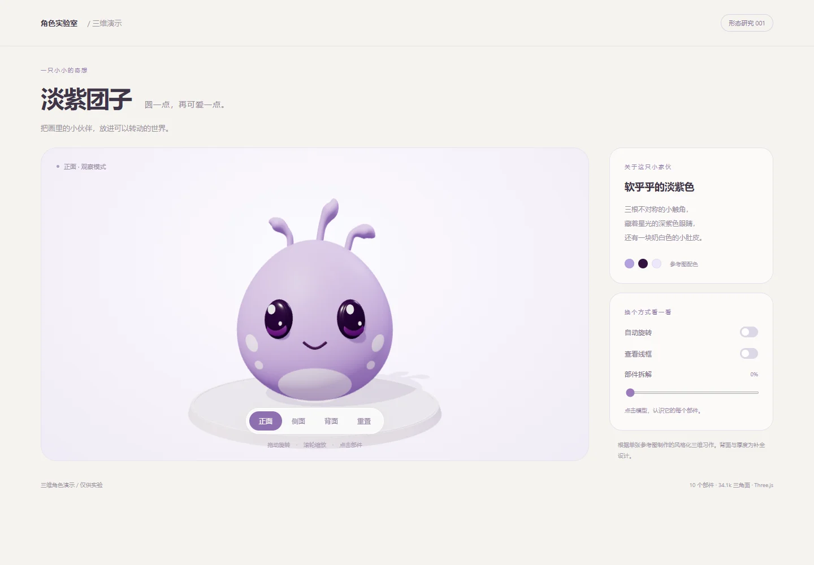

# 三维角色演示

独立实验目录，入口为 `index.html`。不接入冒险、战斗、角色存档或正式 Vite 发布入口。

在项目根目录启动任意静态 HTTP 服务，例如：

```powershell
python -m http.server 8767 --bind 127.0.0.1
```

打开 <http://127.0.0.1:8767/demos/3d-characters/>，选择「淡紫团子」。也可使用现有 Vite 开发服务器访问相同路径。ES Module 需要 HTTP，不能直接以 `file://` 打开。

## 淡紫团子

根据用户提供的 134×129 单张插画进行程序化、风格化重建。连续梨形身体、三根不对称触角、深紫眼睛与双重高光、微笑、贴合身体的浅色肚皮和脸颊斑点；背面与厚度为推断，不代表原游戏模型。

- 拖拽/方向键旋转，滚轮/加减键缩放；支持触屏拖动。
- 正面、侧面、背面、自动旋转、线框、部件拆解、点击识别及重置。
- `lavender-pet/model.js` 导出可复用 `createLavenderPetModel()`，返回独立 `THREE.Group`；`userData.sculptRuntime` 提供部件与拆解接口。
- `lavender-pet/demo.js` 负责演示场景、光照、相机和交互。`design.json` 保存参考观察、层级与质量目标。
- 10 个语义部件、20 个网格、34,080 个模型三角面。无模型下载、无贴图、无随机外形、无骨骼蒙皮。
- 唯一第三方依赖是已核验的 Keepwork Three.js r164 ES module；首次打开需要网络。没有新增 npm 依赖。

## 验证（2026-09-29）

Edge 桌面 1440×1000、手机宽度 390px；正、侧、背及四分之三视角，拖拽、缩放、部件选择、自动旋转、线框、拆解、重置通过；模型顶点/法线均为有限数值，浏览器无错误，窄屏无水平溢出。img2threejs 多角度退化检测通过；与原始插画的未对齐像素轮廓检测未通过（预览包含展台，构图与比例不同），不宣称完成该技能全套严格重建验收。

全量游戏测试结果及已有失败记录见项目 `docs/devlog/devlog_2026-09-29.md`。本演示不需要添加到生产构建或发布。


