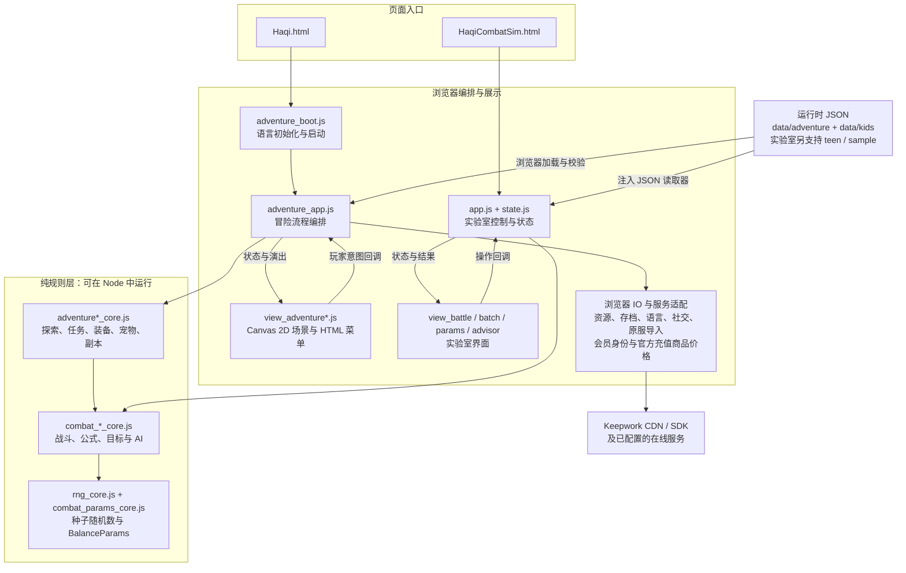
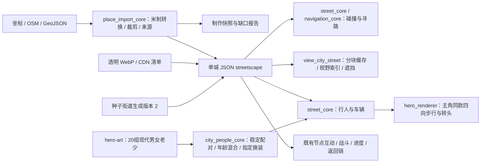
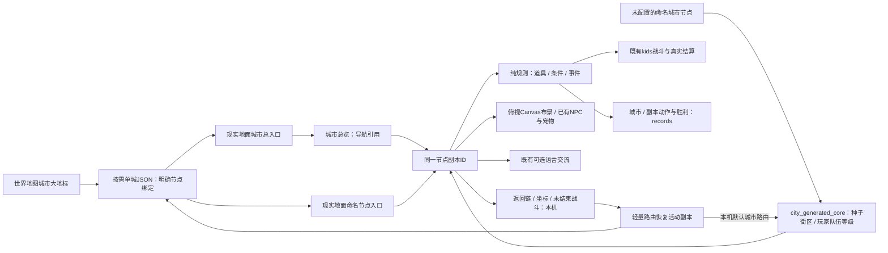
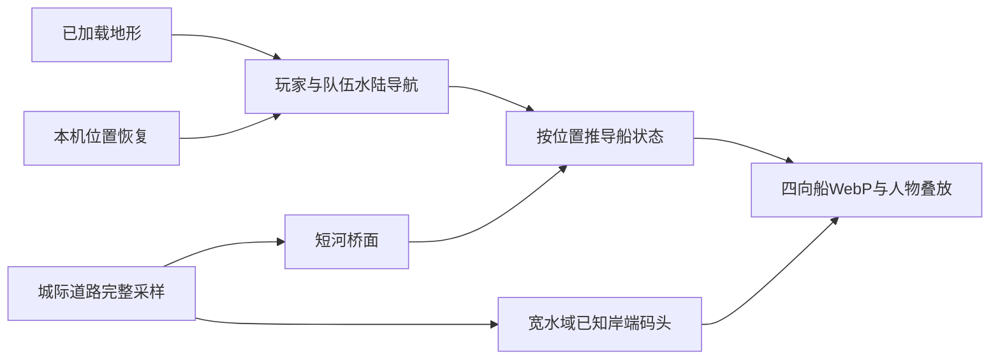
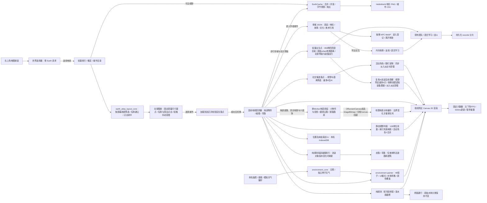
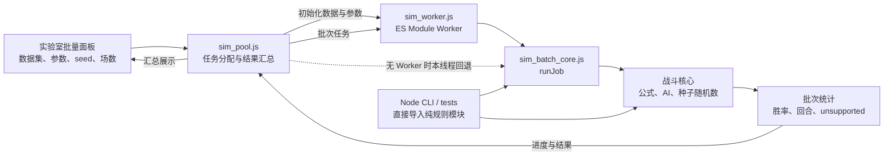
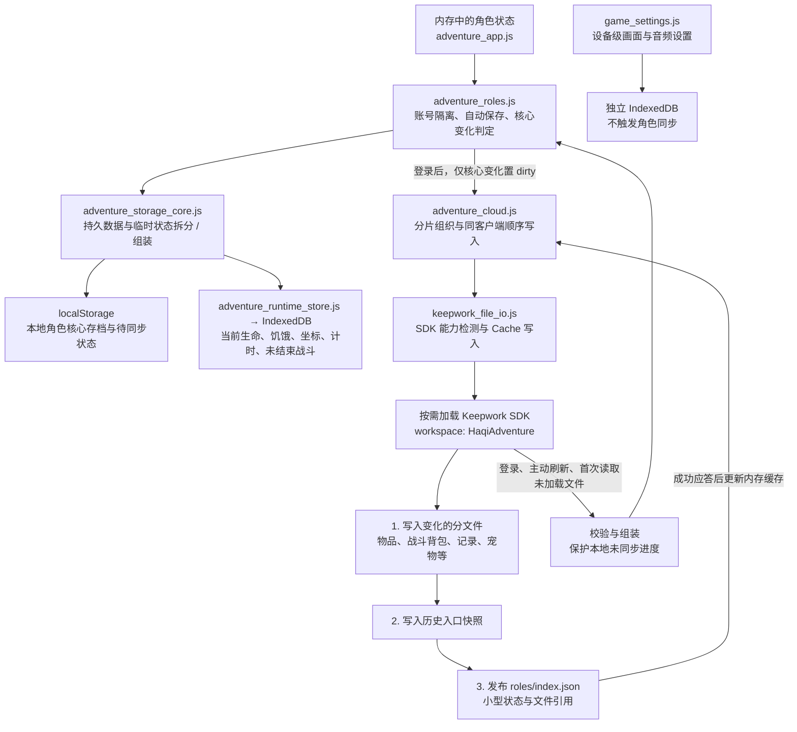
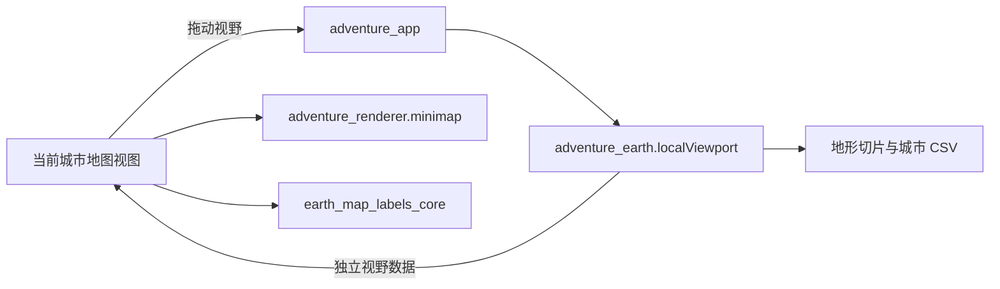

## 2026-09-30：单客户端内存读取与 Cache 直接写入

按用户确认的单客户端写入模式，登录读取服务器最新目录；后续角色入口、已加载分片和宠物文件以内存为准，未加载文件首次使用才读。保存不再查询远端版本或读取历史判断远端分支。主动刷新角色目录和重新登录会重新读取；账号/token 变化使旧请求失效。本地未同步进度与登录快照不同仍保留备份选择，避免直接丢弃本地数据。

所有游戏文件写入集中于 `keepwork_file_io.js`，继续使用 `personalPageStore.withWorkspace('HaqiAdventure')` 的 Cache 接口：`savePageData(path,'content',text,true,true,{directWrite:true})`。新增 SDK option 默认关闭，仅游戏调用启用；跳过 SDK 文件预读和合并，不安排后台同步，等待 pageCache PUT 明确成功，不再写后 GET。支持 `.json` 与 `.md` 完整内容，不改变原文件格式或其他 SDK 用户的默认行为。SDK 能力标志未就绪时沿用旧 Cache 暂存/同步接口，不绕开 SDK；旧 CDN 包仍可能有 SDK 内部预读，新选项上线后才消除这部分请求。

成功后更新内存入口和文件缓存；失败、超时或身份变化不标记角色已同步。写入顺序仍是分文件、历史、入口；同客户端角色保存和 SDK 同路径直接写入串行。不可变分片成功后可复用，重试不重复上传已经确认的文件。关系正文、历史及每日额度首次读取后复用内存；SDK 没有新增远端 CAS。

社交关闭后台轮询，岛屿入口读取名单，邮件在打开时读取，公开名片复用内存并在主动刷新时失效；内容未变化不重复发布。会员普通查询合并请求并复用账号内存，手动刷新、充值和账号事件更新状态。角色目录按角色进一步拆分加载尚未在本轮实现；当前登录仍加载既有角色必要分片。


# HaqiCombatSim — 技术架构

## 架构图

以下按当前源码（2026-10-01）展示主要模块与数据流，省略独立预览工具及部分玩法子模块。图中箭头表示启动、调用或数据传递，不是完整的 import 依赖图；GitHub 可直接渲染 Mermaid 图。

### 1. 游戏与实验室的分层



**分层边界：** 视图负责绘制和事件绑定，控制器协调玩法与 IO；核心规则不访问 DOM、网络或浏览器存储。冒险与实验室复用战斗规则，新增玩家内容以 kids 为范围。冒险细节见 [冒险系统](adventure.md)。

会员充值仅在打开充值页时，由 `adventure_membership.js` 调用 `adventure_recharge_pricing.js` 读取官方公开商品目录（只查询价格，不创建订单），合并并缓存查询；手动刷新可重查。金额、天数、续费日期与魔豆预估由纯 `adventure_recharge_core.js` 计算，再交给视图显示；价格失败时不使用猜测单价，账号身份与付款结果仍以现有 SDK 链路确认。

### 地球世界的按需数据流（2026-10-02）

### 城市节点副本（2026-10-03）

街景 1.0 在既有节点契约上增加可选 `streetscape`；详情见 [城市街景](city-streets.md)。所有原始地理资料保留在制作侧，不进入玩家存档。





`adventure_city_dungeons_core.js` 管理节点契约、明确归属、道具和故事进度；城市加载器负责按需读取与过期请求检查。未配置城市使用 `adventure_city_generated_core.js` 的确定性街区，沿用试炼生命、儿童版技能与奖励，根据当前玩家及准备队伍的最高等级安排挑战。默认城市的来源、布局种子、挑战等级与队伍人数仅存本机以恢复活动场景。副本保留原有战斗结算接口，城市地图构造独立于线性清怪地图。生成技能只在开发期更新单城作者源与轻量路由，不调用运行时内容生成服务。

### 连续地球场景

2026-10-03：地球玩家导航允许已加载水域，`adventure_earth_boat_core.js` 根据地形和桥面推导临时船状态，`view_earth_boat.js` 叠放四向WebP与人物；不写入坐骑装备或云存档。道路采样在宽水域的已知岸端提供码头元数据，地球服务随局部场景更新并按需登记/释放船图集。普通地图抵达保持陆地校验，本机恢复可保留水上坐标。





`adventure_earth_core.js` 保持纯规则；浏览器加载由动态导入的 `adventure_earth.js` 负责。打包器明确排除启动包中的 Earth 内容，逐个保留原相对 JSON 路径。图层共享经纬度变换，不建立全球对象列表或位图；完整单城 JSON 与地理数据独立缓存。详见 [地球世界](earth-world.md)。

### 2. 批量模拟与可复现验证



相同 seed、数据和参数用于重现模拟结果；BalanceParams 统一提供数值覆盖。Worker 将批量运算移出主线程，未支持卡牌效果必须进入统计，不静默忽略。公式来源见 [Lua 对照表](lua-mapping.md)。

### 3. 本地存档与可选云同步



**存储边界：** 未变化分片复用已有引用；临时状态及设备设置不上传。云同步采用单客户端写入假设，不是多人实时状态服务器。SDK 支持时直接等待 Cache PUT 成功，否则兼容原 Cache 同步链路；失败、超时或身份变化不清除待同步状态。访客与网络失败时仍保留本地体验，详见 [用户存储](user-storage.md)。

## 2026-09-25 用户存储分层

当前云端入口为v2小型状态/引用清单；完整物品收藏、战斗背包、历史记录按角色分别保存，只更新变化的分文件。血量、饥饿、坐标、在线时长和未结束战斗仅存本机IndexedDB。`adventure_storage_core.js`负责纯数据拆装，`adventure_runtime_store.js`负责本地IO，`adventure_roles.js`按核心变化判断dirty。详见[用户存储结构](user-storage.md)；下文早期全量存档说明以该文为准。

## 原服导入分层（2026-09-21）

`haqi_original.js` 负责认证及选择性只读背包IO（默认全量以兼容独立测试页）；`haqi_import_core.js` 纯转换并校验新存档；`haqi_import.js` 暂存、身份核验与预览流程；`view_haqi_import.js` 渲染确认入口。预览复用现有背包/卡包面板，传入克隆存档且禁用持久化回调。最终确认才由 `adventure_app.js` 调用角色存储创建新角色，沿用账号隔离/并发写入检查，不直接写原服或云端。

## 1. 加载与运行模型

- 纯 ES Module + Vanilla JS，自带 `css/style.css`（不依赖 CDN，离线可用）；用任意静态 http 服务打开 `HaqiCombatSim.html` 即运行，无构建。
- `HaqiCombatSim.html` 只含顶栏 / `#main` / 底栏骨架，`<script type="module" src="js/app.js">`。
- 数据通过 `fetch('./data/{version}/*.json')` 加载，失败回退 `./data/sample/`。因此需要 http(s) 或 Live Preview 环境，`file://` 下 Worker 与 fetch 可能受限。
- 批量模拟运行在 `new Worker('./js/sim_worker.js', { type: 'module' })`，Worker 内只 import `*_core.js`。

## 2. 目录结构

见 [README.md](../README.md) "目录结构"。分层约定：

```
view_*.js  (DOM 事件) → app.js 回调 → state.js mutate → render(currentView)
                                    ↘ sim_pool.js → sim_worker.js → *_core.js
```

- `*_core.js`：纯逻辑，无 DOM / fetch / 全局副作用，Node 可直接测试。
- `view_*.js`：只渲染与绑事件，通过 `callbacks` 把意图交回 `app.js`。
- `state.js`：单一状态源，`subscribe/notify`。
- `data_core.js`（`readJson` 注入，浏览器用 fetch、Node 用 fs）、`llm_advisor.js`、`sim_pool.js`：唯一允许做 IO 的非视图模块。

## 3. 数据模型

### 3.1 数据集（只读，来自导出器）

```js
dataset = {
  version: 'kids' | 'teen',
  manifest: { cardCount, typeHistogram, supportedTypes, unsupportedTypes, unmapped, exportedAt },
  cards: { [key]: { key, spellName, type, target, pipcost, accuracy, hitchance, spellSchool,
                    requireLevel, canLearn, params: { damageMin, damageMax, damageSchool, dots, ... } } },
  charms: { charm: {[id]: {...}}, ward: {...}, miniaura: {...}, globalaura: {...} },
  statsByGear: { [school]: [ { from, to, hp, damageAllAbsolute, resistAllAbsolute, powerPipPercent,
                               outputHealPercent, criticalstrikeAllPercent, ... } ] },
  aiDecks: { [style]: { school, cards: [ { key, target: 'hostile'|'self', baseWeight, conditions: {colName: weight} } ] } },
  aiDecksByGear: { [school]: [ { from, to, style, cards: [ { gsid, key|null, count } ] } ] },
  hpTable: { [level]: hp },
}
```

### 3.2 BalanceParams（可写覆盖层，`combat_params_core.js`）

```js
params = {
  version: 'kids' | 'teen',
  global: { maxPips, maxRounds, handSize, deckCapacity, deckEachCapacity, deckPresetCopies,
            critDamageRatio, dodgeDamageRatio, maxSpellPenetration, areaSiblingRatio, healPenalty },
  //   deckCapacity / deckEachCapacity：卡包总容量 / 单卡上限（Lua 卡包道具 stats[167] / [170]），默认 40 / 6，0 = 不限
  //   deckPresetCopies：未自定义配卡时官方卡组每卡份数（默认 3；模拟器项）
  perSchool: { fire: { hp: 1, damage: 1, heal: 1, accuracy: 0, powerPip: 0, resist: 0, crit: 0 }, ice: {...}, ... },
  //   hp/damage/heal 为乘子；accuracy/powerPip/resist/crit 为加法百分点
  cardOverrides: { [cardKey]: { pipcost?, accuracy?, params?: { damageMin?, damageMax?, ... } } },
  fairPlay: null | { maxHp: {fire: n, ...}, forceDamageBoost, forceResist, forceAccuracyBoost, forcePowerPipChance },
}
```

`resolveParams(dataset, params)` 返回引擎实际读取的 `resolved`（卡牌模板已合并 override，perSchool 已归一）。`diffParams(a, b)` 用于面板高亮与调参器输出。

### 3.3 单位（`combat_unit_core.js`）

```js
unit = {
  id, name, side: 0|1, school, level, isBot,
  maxHp, hp, pipsNormal, pipsPower,
  stats: { damagePct: {school: n}, damageAbs: {school: n}, resistPct: {...}, resistAbs: {...},
           accuracyPct: {...}, crit: {...}, resilience: {...}, hitRating, dodgeRating,
           hitPct, dodgePct, penetration: {...}, penetrationReceive, powerPipPct,
           outputHealPct, inputHealPct },
  charms: [ { id, boostDamage, boostAccuracy, school, positive, dispelSchool, ... } ],
  wards:  [ { id, ... } ],
  absorbs: [ { remaining, school } ],
  dots: [ { school, perRound, rounds, casterId } ], hots: [...],
  miniaura: null | { id, rounds }, stun: 0, stances: [...],
  deckSpec: [ {key, count} ],            // setDeck → clampDeck 按 deckCapacity / deckEachCapacity 裁剪，deckTrimmed 记录裁掉张数
  deckSeq: [ cardKey... ], deckMap: [ 0|1|-1|-2|-3 ],  // 洗牌后的序列与状态：未抽 / 手牌 / 待弃 / 已用 / 失误补入
  cooldowns: { [spellName]: rounds },
  totals: { damageDealt, healDone, damageTaken, casts, fizzles, passes, noCardPasses },
}
```

卡包相关纯函数：`clampDeck(deck, {capacity, eachCapacity, cards, version})`、`deckCounts(unit)`（手牌 / 待弃 / 未抽 / 已用 / 失误 / 剩余 / 总数）、`isDeckExhausted(unit)`、`restoreDiscardedCard`。`playTurn` 对 `pick.discardSeqs` 的处理与是否出牌无关（Lua 允许弃牌 + 跳过）；无手牌时 `pass.reason` 为 `no_cards` / `deck_empty`。`checkFinish` 在双方存活单位全部打空且无 DOT 时提前判 `timeout` 平局（`decksExhausted=true`，纯加速，不改变结果）。

### 3.4 竞技场与事件（`combat_arena_core.js`）

```js
arena = {
  params: resolved, rng, round: 0, state: 'active' | 'finished',
  sides: [ [unit...], [unit...] ], globalAura: null | {...}, healPenalty: 0,
  events: CombatEvent[], stats: { perUnit: {...}, perCard: {...}, unsupported: {...} },
  winner: null | 0 | 1 | 'draw',
}
CombatEvent = { round, type: 'pip'|'pick'|'cast'|'fizzle'|'damage'|'heal'|'charm'|'ward'|'dot'|'hot'|'stun'|'death'|'end',
                casterId?, targetId?, cardKey?, amount?, crit?, dodged?, school?, detail? }
```

`advanceTurn(arena, picks)`：
1. 每个存活单位 `generatePip`；抽牌补到 `handSize`；cooldown / stun 递减。
2. `picks` 为 `{unitId: {cardKey, targetId} | null}`（由 Policy 给出；Human 由 UI 提供）。
3. 按顺序（先 side 0 再 side 1，或按 arena 顺序规则）逐个 `useCard`：合法性 → 扣 pips → accuracy → 分派 type 处理器 → 事件。
4. DOT / HOT 结算与递减，aura / miniaura / charm 时长递减。
5. 死亡判定；`round++`；`isFinished` 判胜负或超 `maxRounds` 判平。

### 3.5 策略（`combat_policy_core.js`）

```js
Policy = { pick(arena, unit, rng) => { cardKey, targetId } | null | Promise<...> }
```

- `DeckAttackerBot(aiDeckStyle)`：对手牌中每张卡查 `aiDecks[style].cards[key]`；权重 = `baseWeight + Σ(命中的条件列权重)`；条件列语义见 [data-export.md](data-export.md)；负权重剔除；加权随机选卡；目标按 `target` 字段（hostile → 敌方按低 HP 加权，self/friendly → 自己或最需要的队友）。
- `SimpleBot`：无 CSV 时的后备：队友 HP < 40% 且有治疗 → 治疗；有 blade 且可出大招 → 大招；否则最高期望伤害卡打最低 HP 敌人；出不起则 Pass。
- `HumanPolicy`：返回 Promise，`view_battle.js` 在玩家点选后 resolve。

## 4. 批量模拟

- `sim_batch_core.js`
  - `buildMatrix({ schools, modes, levels, gearBand, composition })` → `matchup[]`，`composition` ∈ `'mirror-school'`（同系队）| `'mixed'`（随机混编）。
  - `runOne(matchup, resolved, seed)` → `{ winner, rounds, perSide: {damage, heal, fizzles}, cards: {...}, unsupported: {...} }`。
  - `aggregate(results[])` → 胜率、Wilson 95% 区间、平均回合、场均伤害 / 治疗、fizzle 率、卡牌使用频次与贡献伤害、未支持卡出现次数。
- `sim_worker.js`：`onmessage({ dataset, params, matchups, gamesPer, seed })`；每 50 场 `postMessage({type:'progress', done, total})`；结束 `postMessage({type:'done', results})`。
- `sim_pool.js`：按 `hardwareConcurrency` 建 Worker；按 matchup 分片；合并结果；支持取消。

## 5. 调参器（`sim_tuner_core.js`）

- 输入：矩阵配置、当前 params、可调维度（默认 `perSchool.*.{hp, damage}`）、步长、迭代上限、每次评估场次、seed。
- 目标：`loss = Σ_matchups (winrate − 0.5)²`（可加权：1v1 权重高）。
- 算法：坐标下降；每个维度尝试 ±step，取 loss 最小；无改善则 step 减半；到达迭代上限或 step < 最小步长停止。
- 输出：`{ params, history: [{iter, loss, change}], before: matrix, after: matrix }`。
- 运行在 Worker 池上（每次评估是一次批量任务），UI 显示进度并可中止。

## 6. LLM 建议（`llm_advisor.js`）

- `buildPrompt({ aggregate, params, manifest, version })`：中文系统提示（角色：数值策划），附矩阵、平均回合、每系前 5 张高频卡及数值、当前 perSchool 系数、未支持卡占比；要求输出：诊断、建议、可选 ```json 参数块（BalanceParams 子集）。
- `requestAdvice({ endpoint, apiKey, model, prompt })`：`POST {endpoint}/chat/completions`，OpenAI 兼容；凭据仅存 `localStorage`。
- `extractParamsBlock(markdown)`：解析 ```json 块 → 可应用的 params 片段。

## 7. 页面路由（`app.js`）

| 路由 | 视图 | 说明 |
|------|------|------|
| `battle` | `view_battle.js` | 配置阵容 → 对战 → 结束面板 |
| `batch` | `view_batch.js` | 矩阵配置 → 运行 → 热力图 / 表格 / 导出 |
| `params` | `view_params.js` | 参数编辑 / diff / 导入导出 |
| `advisor` | `view_advisor.js` | 调参器 + LLM |

顶栏：数据集下拉（`discoverDatasets` 找到的 kids / teen / sample；切换时 `loadDataset` 并把 params 重置为该 version 默认值，若 localStorage 有同 version 的参数则恢复），数据集状态标签。

## 8. 测试

`npm test` = `node --test tests/*.test.mjs`，零依赖，30 例：

- `tests/formulas.test.mjs`：rng 确定性；`aboveMinBoost` / `damageExpression`（kids 逐项 ceil、teen 正负 buff 分治、穿透上限）/ `healExpression` / 治疗惩罚；crit / dodge / fizzle 阈值与大样本频率；五系 HP 曲线端点与装备 HP%；power pip 概率；`generatePip` 双版本；`canAffordCard` / `costPips` 本系 / 他系；竞技场伤害递增与 absorb。
- `tests/engine.test.mjs`：sample 数据集加载与预设卡组；1v1 跑通；同 seed 结果全等；2v2 / 3v3 / 4v4 完成；Random / Simple 策略；状态机（手牌 / 可出牌 / snapshot）；`perSchool.hp` 生效与 diff；X 费 DOT 与溅射 DOT；`buildJobs` 25 组 + 聚合自洽（A→B + B→A + 平局 = 1、CI 包含点估计）；`matchupMatrix`；`wilson`；调参器在假模型上收敛；LLM 提示词 / 参数块解析 / 启发式补丁。
- `tests/xml_lite.test.mjs`：声明 / 注释 / CDATA / 自闭合 / 实体 / 嵌套 / CRLF。

## 9. 意图 vs 现实

实施完成（2026-09-16）后的对照：

| 计划 | 实际 | 原因 |
|------|------|------|
| Tailwind CDN | 自写 `css/style.css`（约 180 行） | 离线 / 内网可用，避免外链 |
| `fast-xml-parser` devDependency | `scripts/lib/xml_lite.mjs` 零依赖解析器 | 配置 XML 结构简单；`npm install` 都不需要 |
| `config.js`、`i18n.js`、`data_loader.js` | 并入 `state.js` / `combat_presets_core.js` / `data_core.js` | 模块数量已多，避免碎片化 |
| `view_*.js` 通过 `callbacks` 回 `app.js` | `view_*.js` 直接 import `state.js` 的 mutator（`updateParams`、`setSetting`…） | 单页应用无需二级间接层；`view` 仍不含引擎逻辑 |
| `threat.json` | 未导出 | PvP 不使用威胁值 |
| 5 个测试文件 | 3 个测试文件 30 例 | 合并同类用例 |
| `HumanPolicy` 返回 Promise | `HumanPolicy.pick` 返回 `null`，由 `view_battle` 收集人类选择后调用 `playTurn(arena, picks)` | 半回合制下所有行动方同时出牌，同步接口更简单 |
| 单体 charm / ward 目标由 type 决定 | 由模板 `positive` 推断（`inferTargetKind`） | Lua 由客户端选目标、服务器不校验；陷阱 / 虚弱必须贴敌方 |

未支持 type（kids 37 张 5.3%，teen 53 张 4.2%）：`Dead`、`PickPet`、`CatchPet`、`Fizzle`、`SingleFreeze`、`ConversePositiveWard`、`SingleStealth`、`SingleGuardianWithImmolate`、`Enrage`、`SingleTaunt`、`AreaTaunt`、`AreaControl`。均不出现在官方 Aggressive 卡组，预设卡组过滤后批量报告的「未支持」为 0。

性能实测（Node 24 单线程）：teen 1v1 ≈ 5800 场/s，kids 1v1 ≈ 8200 场/s，teen 4v4 ≈ 1250 场/s；浏览器 8 worker teen 1v1 ≈ 14000 场/s。

分层未被打破：`js/*_core.js` 无 DOM / fetch（`node --input-type=module -e "import('./js/x.js')"` 可逐个加载，只有 `app.js`、`sim_worker.js` 依赖 `document` / `self`）。

## 10. 与仓库其他部分的关系

- 只读引用 `script/apps/Aries/Combat/ServerObject/*.lua` 作为规范来源，不修改。
- 只读读取 `config/Aries/`（gitignored）生成数据。
- 已在 `docs/aries/haqi-combat-sim.md`、`docs/CODEMAP.md`、`docs/TOPIC-INDEX.md` 登记。
- 计划中的「线上角色导入」「异步 PVP」「帕鲁式宠物/VIP 口粮」「卡牌多语言」不改变本节模块边界：玩家 IO 与 locale 表只能放在浏览器适配层或数据 JSON，`*_core.js` 仍禁止 `fetch`。对照 [player-import.md](player-import.md)、[async-pvp.md](async-pvp.md)、[pets-vip-innovation.md](pets-vip-innovation.md)、[card-i18n.md](card-i18n.md)。

## 11. Haqi.html 单人冒险（2026-09-17）

新增入口及 `adventure_app.js` 控制器。`view_adventure.js` 只构建DOM并传回事件；`adventure_renderer.js` 绘制Canvas世界/战斗；`adventure_assets.js` 负责HTTP资源与localStorage。规则拆为 `adventure_core.js`（任务/道具/成长/存档结构）、`adventure_world_core.js`（地图/移动/交互）、`adventure_content_core.js`（内容验证）。

`combat_pve_core.js` 复用 `combat_cards_core.js`、`combat_formulas_core.js`、单位和参数解析，不调用PvP半回合推进。PvE完整回合是所有单位生成魔力 → 怪物前置动作 → 玩家 → 怪物普通动作 → 怪物后置动作。怪物使用源脚本/HP基因/可重复技能池；玩家用有限卡包及装备附加牌。仅在公共伤害模块加入 `arena.mode === 'pve'` 分支，PvP行为由原34测试回归覆盖。

存档使用独立键和决定重演；世界装饰随机数与战斗随机数不共享。数据与资源准备为开发命令，所有运行时文件位于本目录，无父目录/兄弟模拟器导入。完整契约见 [adventure.md](adventure.md)。

## 12. WebP / CDN 与可选云存档（2026-09-17）

`adventure_media_core.js` 是纯资源策略：loopback默认local，线上默认CDN，显式查询参数可切换。`adventure_assets.js` 根据 `media.json` 读取WebP并设置CORS；`assets.json`仍为原版来源清单。Pillow开发脚本负责完整解码及无损转换，发布脚本生成内容哈希命名的上传计划、在远端验证后记录URL，不包含上传凭据。运行时不执行资源准备。

`adventure_cloud_core.js` 只处理版本化封装和原存档/战斗重演校验；时钟/UUID从IO层传入。`adventure_cloud.js` 按需加载Keepwork SDK core，使用独立PersonalPageStore workspace写入唯一检查点；验证远端原始JSON，避免SDK缓存/本地回退导致假成功。`view_adventure_cloud.js`只渲染连接、保存、列表、进度比较和确认，控制器负责替换本地进度。

云端恢复前检查账号未变化、本地原文与预览时一致、备份写入成功。任一失败均不覆盖主存档。SDK读写超时不等于请求已取消，失败提示要求刷新检查；不会自动重试覆盖同一文件。2026-09-25 起改为 savePageData(path,content,text,false,true) 暂存，再 syncToGit(path,true)，并通过服务器缓存 API 核验内容。角色目录读取也开启 useCache/useServerCache；保留自动云同步和角色冲突检查。钓鱼镜像仅在纪录变化时写入，完整玩法配置首次进入钓鱼才加载。

## 13. 技能演出

`spell-effects.json`集中定义45张冒险牌的演出类型、五系颜色、时间轴、粒子和召唤角色裁剪；`spell_effects_core.js`验证配置并独立播种视觉数据，`spell_effects.js`绘制Canvas演出。战斗控制器只改变cast事件展示时长，渲染器传入实际caster/target坐标。`HaqiEffects.html`提供无存档副作用的独立预览。详见[技能特效](spell-effects.md)。

## 14. 全卡库特效与共享变体

特效配置升级版本2：701个card引用225个base，变体共用品质光环。`prepare_spell_effects.mjs`显式映射所有导出type，`export_spell_names.py`通过Lua数据解析器导出中文名，`audit_spell_effects.mjs`同时校验全卡库和章节覆盖。工坊额外读取本地kids快照，游戏仍只读取原章节战斗数据；因此不会将未支持的战斗机制自动解锁。群体演出接收目标坐标数组，未修改战斗公式/规则。

## 2026-09-18：装备面板补全

新增 adventure_equipment_core.js 的纯属性展示与无副作用换装预览；装备穿戴仍由 adventure_core.js::applyAction 校验并执行，新增 unequip 动作。view_adventure_equipment.js 负责角色、槽位、背包筛选、详情和操作回调；adventure_app.js 保留面板筛选状态并处理存档与换装后的滚动/焦点。沿用原装备 stats、法杖强化表与固定卡，不修改战斗公式。


## 2026-09-18：共享技能美术

`skill_art_core.js` 校验图集和计算裁剪帧，无浏览器IO；`skill_art.js` 负责去重加载、动态卡面和主体绘制。`CardRenderer` 程序绘制标题与 `cardDescription`（中文套话 + 伤害/治疗数字）。`adventure_assets.js` 预加载章节需要的图集；`spell_art.js` 为工坊提供按需适配；`spell_effects.js` 复用同一主体并播放专属九帧。HaqiCards按学系/搜索分页展示全库；`skill_card_preview.js` 为儿童版模拟器手牌异步补图。美术不消耗战斗RNG，不改变数值规则。清单含本地/CDN、来源和独立哈希，新增WebP严格≤100KB。冒险界面语言见 [locale.md](locale.md)。卡名与带数字的卡面说明仍见 [card-i18n.md](card-i18n.md)。

## 2026-09-18：技能音效与粒子分层

图集主体不终止spell_effects.js的语义粒子分支，复用原kind/attack/secondary与时间轴。spell_sound_core.js只产生确定性的音效配方和跨帧触发节点；spell_sound.js负责Web Audio生命周期与本机开关，控制器按进度驱动，Canvas draw不直接发声。群体技能一套声音，粒子可多目标；两者都不消耗战斗RNG。


## 2026-09-18：调试属性编辑

adventure_debug_core.js 从内容构造数值字段目录，在副本上应用白名单修改、修正装备与配卡并走 parseSave 完整验证。adventure_debug.js 负责独立调试备份和本地写入；view_adventure_debug.js 仅管理表单草稿/预览与回调，adventure_app.js 校验成功且持久化完成后替换当前状态。未修改战斗公式、BalanceParams或存档版本。

## 宠物与商店扩展（2026-09-18）

`adventure_expansion_core`在原章节验证后合并静态宠物目录、原版装备候选与kids卡牌库；`adventure_pets_core`负责收藏、四卡位编队、商店、喂食和联动协议。浏览器IO注入恢复时间并按需加载宠物图集。`view_adventure_pets`只绑定意图回调；controller统一修改进度。

PvE可选接收`party`，主角保留第一项、显式slot控制站位及行动顺序；辅助宠物附卡不新增战斗单位。检查点包含完整入场规格和捕获库存，重演只使用种子与决定。版本2存档通过原本地、JSON和云端路径保存，版本1迁移不覆盖任务成果。参见[pets-and-shop.md](pets-and-shop.md)。帕鲁式深化与 VIP 口粮见[pets-vip-innovation.md](pets-vip-innovation.md)（未实现）。

## 2026-09-18：Vite与CDN发布

用户明确要求参考Maisi/MagicHaqi接入Vite。新增四入口构建、相对资源路径、静态JSON/WebP/Ogg复制、内联批量Worker与内容哈希CDN发布；此项取代早期“禁止打包器”的开发约定，原生ES modules源码仍可直接通过HTTP服务运行。详细命令与发布核验见[部署说明](deployment.md)。

最终构建与发布都排除美术/音频；所有域名默认CDN，源码显式离线模式保留。已核验52文件正式CDN版本与跨域发布页的7500场Worker模拟，详见qa-report。

## 2026-09-18：发布数据包与浏览器IO

runtime_data.js统一浏览器JSON读取；Vite生产构建将源码data的32个运行时JSON投影压缩到5包，manifest索引独立，以免数据集发现触发全版本下载。读取结果复制后交给原加载逻辑，避免共享缓存受规范化和冒险扩展修改。data_core移除fetch包装，保持Node注入式数据加载。详见deployment.md。


## 2026-09-19：世界地图

adventure_world_map_core集中六岛身份、出生点与BalanceParams.worldTravel等级检查；view_adventure_world_map仅展示选中岛屿和传送状态，控制器通过既有travel动作切换场景并保存。adventure_world_core复用可复现地形与碰撞，adventure_terrain区分远方岛屿地表；原版岛屿专属内容仍未导入。存档校验、调试降级和云端位置展示共用岛屿定义。

## 2026-09-20：大型岛屿地图

config/maps 提供六岛源文件与统一地域规则；adventure_map_generator_core 在离线生成阶段写入 data/adventure/maps，adventure_island_layout_core 提供纯几何与元数据查询；adventure_world_core 装配运行时对象并缓存空间桶/道路图；adventure_large_terrain 负责固定内存预算的分块地面和低分辨率导览。view_adventure_local_map 仅绑定目的地意图，adventure_app 负责步行与交互。worldLayoutVersion=2 标识六岛新地图坐标，parseSave 区分旧版尺寸校验和位置迁移；旧任务、战斗与来源数据不修改。详见 island-exploration.md。

## 2026-09-26：岛屿伙伴与快照组队

`adventure_social_core` 处理名单、通信摘要和快照校验，`adventure_social_motion_core` 只做种子行为；`adventure_coop_core` 隔离副本进度、冻结阵容并保留血量；`adventure_social_pvp_core` 复用 free_pvp 及决定重演。`adventure_social` 是 SDK IO 边界，`adventure_social_controller` 连接场景和 UI，view 层只提交意图。组队房间对齐原版四人席：先选副本，空席开放后延迟补 AI。组队继续使用现有 PvE 与地图，不另写战斗公式。服务门禁与模块契约见 [岛屿社交](island-social.md)。

## 独立战斗AI（2026-09-27）

`js/battle_ai/index_core.js` 为纯服务入口；推理、配包、复盘与关卡统计不依赖页面。`haqi_adapter_core`复用真实结算器，`adventure_adapter_core`提供角色资格及入口路由。浏览器client/worker是IO边界。战斗RNG、AI抽样及复盘文案种子彼此隔离。接口和限制见 [battle-ai.md](battle-ai.md)。

## 2026-09-27 角色对话与关系IO

`character_relationship_core.js`负责纯规则、提示词、额度和赠礼；`character_workspace.js`负责账号/角色分文件、缓存API与版本检查；`character_conversation.js`控制LLM、语音和共享聊天视图，`view_character_details.js`负责关系/礼物详情。副本事件在settleEncounter结算内登记，可选第四参数`{now}`由调用方提供；未提供按0处理，不从核心读取系统时钟。参见[关系存储与限制](character-conversations.md)。

## H5 宣传片（2026-09-28）

`HaqiPromo.html` + `promo_app.js` 管理独立 JSON 剧本和时间轴，通过同源 iframe 调用 `promo_stage.js`。舞台复用正式游戏视图和 core 模块，只维护内存角色，不导入主应用或账号/存储客户端。`promo_timeline_core.js` 为纯时间轴与字幕模块。剧本单独打包为 `data/promo/film.json`，不进入游戏启动包；详见 [promo.md](promo.md)。


## 全局语言学习规则入口

产品规则统一维护于 [语言学习设计](language-learning.md)。各口语控制器通过 `onSpeech`（副本为 `award`）提交有效事件，`adventure_app.js` 的 `awardLanguageSpeech` 调用纯核 `language_daily_buff_core.js` 分配当日奖励；视图不自行增加属性。角色 runtime 保存每日状态，durable/cloud 投影剔除；战斗入口冻结加成供重演。剧情、课程与自由对话判定仍由各自控制器负责。新增学习场景复用该公共奖励路径，数值、日期、存储、UI 和快照变更按该设计中的维护表联动检查。

语音交互复用：`dialogue_voice_session.js` 为自由角色聊天与副本剧情提供无 DOM 的 ASR/TTS 生命周期，`view_dialogue_microphone.js` 提供共享录音按钮和手势。业务判定、额度、buff 与推进留在调用方，详情见语言学习设计的共用组件边界。

地球高清表现层（2026-10-02）：`adventure_earth_surface_core.js` 负责纯地类混合与确定性采样；`adventure_earth_surface.js` 将真实分类和预制 WebP 合成为可见 Canvas 小块，使用单任务分帧队列、64 块 LRU 上限和统一像素边缘。`adventure_earth.js` 仅在实际绘制地球场景后读取 `surface-art.json` 与图集，图册阶段不加载。视觉层不改变地理碰撞、怪物随机流或持久数据。详见 [地球地表与装饰](earth-world.md#高清地表与地理装饰2026-10-02)。
# 城市地貌生成补充（2026-10-02）

`adventure_earth_transport_core.js` 复用已加载城市坐标，为通用城市生成有限聚落布局覆盖、铁路与站前设施；不依赖 authored region。铁路走廊先预留，再放置普通街区建筑。`city-art.json` 的交通图集按实际出现的物件类型加载，地理碰撞仍使用原始地类；列车只作为环境物件。

地表像素生成现在经单个原生 module Worker 执行，主线程只收集块内地类、接收转移的像素缓冲并提交 Canvas；失败使用分帧回退。`adventure_earth_city_layout_core.js` 为地表和物件共享街区分区。场景流送分批构建临时数据，校验 epoch 后一次替换，不在异步处理中暴露半完成数组。

高清地表队列按可见块优先，再预热周边一圈，合计受 64 块缓存预算限制；城市铺装在地表像素生成阶段烘焙，街灯等竖立物件保留 Y 排序。地标等比缩放和避让完整道路集合由纯核心函数负责，不依赖当前视口。

Earth 的 `adventure_earth_city_core.js` 只处理人口等级、稳定地理格点和物件候选；`adventure_earth.js` 提供已加载地表查询与安全空间过滤，并仅在场景有城市物件时读取 `city-art.json` 与两张 WebP。城市装饰与地标共用相机相对绘制和 Y 排序，不进入地图浏览或启动依赖。捕鱼通过 `isOcean` 的 Earth 分支读取真实地表分类，海岛规则保持独立。

城市底图补充（2026-10-02）：`surface-art.json.cityGround` 引用独立AI绘制连续街区的四张WebP，HelloWorld city02.png只保留为来源参考；仅实际地球场景加载，整幅像素传入单个 Worker 与主线程回退，城市地类按地理坐标混合采样。场景流送提交单元包含对象数组和 `drawEarthBuilding`，避免图片异步加载时数组与绘制器版本错配；Earth 不使用海岛精灵作为建筑缺图回退。城市底图保留细街巷纹理；场景道路统一为城市之间的连接，旧深圳作者道路不再加载，安全导航保留。


2026-10-02 地球渲染更新：城市道路连接由adventure_earth_transport_core.js按经纬度生成并裁剪，仍为纯核心层；浏览器IO层按需加载四张独立城市WebP，合成一张连续纹理后交给原生Worker。高清资源不进入网站发布包，永久CDN与明确离线模式继续使用同一清单。

2026-10-02 公路视觉调整：城际路面默认52单位，浅灰米色、浅路肩及渐淡外缘，弯道连续描边；地标避让使用当前城际道路。旧深圳道路 JSON 与离线生成脚本已删除，城市组件清单只引用当前使用的数据；程序城市支路不再放入world.paths。

城际连接在纯核心层精简可经更近城市到达的冗余三角长边；adventure_renderer在场景绘制完成后以屏幕坐标显示mapCities和landmarks名称，保持字号稳定并避让人物与其他地名。

### 当前城市地图视野

view_adventure_earth_local_map 将拖动视野通过 adventure_app 回调交给 adventure_earth.localViewport，按需请求既有地形切片与城市 CSV，并返回独立的地形采样、城市坐标与道路。此路径不执行 prepare/update，不改变游戏世界、玩家位置或存档。adventure_renderer.minimap 使用返回数据绘制；earth_map_labels_core 只计算屏幕空间名称避让，视图绘制连接真实坐标的连线。定位按钮只重置视野；窗口 dispose 与视野版本丢弃过期结果。



2026-10-02 地球流送稳定性：进入场景记录已经生成的逻辑块，避免下一帧重复构建。IO层生成下一邻域后，reuseEarthObjects按稳定编号/坐标复用重叠区域未变物件，并在物件变化时才通知空间索引与社交层。地表缓存以固定地理块为键，新源瓦片只标记采样范围相交的块（包括日期线回绕）；旧画布在替代块完成前继续绘制，过期Worker结果拒绝提交，内存块数仍受原预算限制。


2026-10-02 单城居民与任务：世界索引只保存城市范围与 cities/<id>.json；进入覆盖区加载完整单城配置，交谈复用内存。adventure_earth_city_config_core.js 负责纯配置与进度规则；earthCityProgress 按城市/章节/支线隔离并进入 records 分片，旧深圳进度兼容。NPC图片通过 adventure_assets 的动态登记与释放复用既有角色绘制，离开城市释放，共享图集不进入启动包或dist。交谈复用岛屿样式与共享关闭按钮，意图回调交给 app，战斗事件仍在真实结算推进。


2026-10-03 地球小物件烘焙补充：`adventure_earth_surface_objects.js` 为主线程与 Worker 共享小装饰绘制和投影。草丛、岩石、花草、麦穗、雪堆等按实际精灵及投影范围索引到相交分块，流送时只更新变化的块；高树继续 Y 排序及遮挡淡化。支持 OffscreenCanvas 时 Worker 合成地表、道路与装饰后转移 ImageBitmap，主线程直接纳入有界缓存；不支持合成时仍转移像素并在主线程分帧回退。缓存记录绘制身份，兼容空间索引浅复制，部分缓存期间逐块裁剪临时装饰，避免跨块重复绘制。过期、淘汰和退出的 ImageBitmap 显式 close；完整覆盖后跳过底层源地形与临时道路重画。
