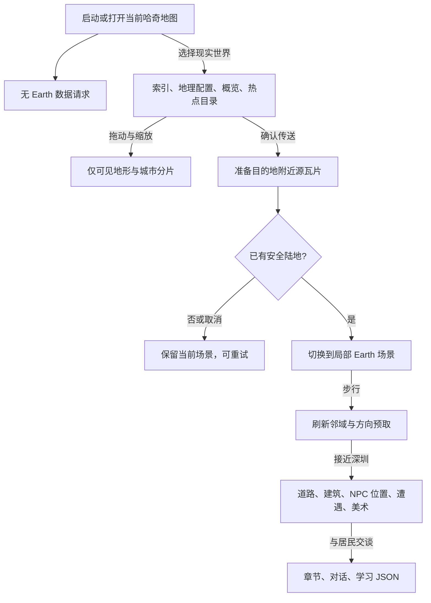

# 两个平行世界：按需探索地球

右上角地图按钮直接显示当前区域地图：哈奇场景显示当前岛屿，地球场景显示现实世界地图。地图标题旁的「哈奇世界 / 现实世界」页签直接切换两张并行世界大地图，无需先打开选择窗口。玩家与宠物保留同一角色、背包、成长和已有岛屿进度。现实世界使用连续经纬度空间，地图传送先准备安全陆地，成功后才替换当前场景；关闭地图取消加载，失败可以重试。海洋不能步行穿过，可以用地图跨海传送。

本文记录当前实现，不代表游戏已发布。实现入口见 [整体架构](architecture.md)，逐轮检查见 [QA 记录](qa-report.md)。内容维护者可从下方「维护深圳内容」开始；网络与缓存问题见「故障定位」。

## 玩家旅程与当前范围

1. 点击右上角地图查看当前区域，使用顶部「哈奇世界 / 现实世界」切换大地图。
2. 现实世界图册可以拖动、缩放和输入经纬度；选择深圳热点可抵达安全集合点。其他陆地目的地也可传送，先检查实际已加载地表。
3. 与林澄交谈，按照章节提示寻找蛇口、华强北和大鹏的居民。地图可定位下一站，长距离旅途无需全程步行。
4. 比较居民提供的消息，确认城外目标后参与防御，再返回报告。错误推理选项给出提示，不扣除进度；可选语言练习沿用现有学习流程。
5. 随时从哈奇地图返回原有岛屿。角色、宠物、物品和成长属于同一份存档。

目前的精修范围是深圳六地标与一条章节；其他城市使用真实城市位置及确定性的游戏建筑、道路、植被和伙伴。建筑不是逐栋真实复原，AI 伙伴沿用已有社交能力，不能将其视为当地真人在线。历史记忆为明确标注的虚构角色演绎。

## 加载边界

启动与哈奇地图不请求任何 Earth JSON、地形、城市 CSV、人物、任务或美术。选择地球后才动态导入浏览器服务，读取小型索引、地理配置、低清概览和 HelloWorld 的轻量城市目录（核验时约 15.6 KB）。目录只用于地图热点；不会展开城市场景。

地图跨度小于等于 10 度才读取可见的 20 度城市 CSV 分片，小于等于 4 度才读取可见的 2 度地形分片。详细地图不请求人物、建筑或章节。地图支持拖动、缩放、经纬度定位；海外目的地同样验证陆地。

进入场景后仅保持附近 5×5 个逻辑块，周围小圈及移动方向提前读取源瓦片。源瓦片是 HelloWorld 的最小下载单位，单个瓦片本身覆盖的地理范围较大，不代表加载其中所有场景。接近深圳才加载其道路、建筑、人物位置、遭遇与美术清单；交谈时才取章节、对话与学习内容。原始 PNG/CSV 不复制到项目。

`EarthCache` 合并同键请求，并发默认 4、排队上限 48、地形最多 12 片、城市最多 4 片、缓存预算 32 MiB。解码图片以像素内存计费，城市文本按解析后的保守估计计费。准备目的地时锁定当前场景的瓦片与美术，失败或取消不淘汰仍在使用的场景。远处条目淘汰；对象空间索引及怪物游走缓存随区域更新裁剪。地图保留低清概览，不创建全地球位图或寻路网格。参数通过 `BalanceParams.earth` 覆盖。失败地形保持灰色未知区域并阻挡移动，不变成虚构陆地或海洋。



传送准备和角色退出会更新服务的取消代次并中止请求。已命中缓存的 Promise 同样可能延迟完成，所以章节加载在返回前还会检查代次、当前世界和区域编号。离开作者区域清除当前章节引用，但不删除角色的持久章节进度；回到区域后仍在交谈时按需取得正文。取消只使旧结果失效，不应把它写回新角色或新世界。

### 预算与坐标约定

数值来源为 [combat_params_core.js](../js/combat_params_core.js) 的 `earth` 默认参数。以下为当前默认值，调整时以源码为准。

| 参数 | 默认值 | 用途 |
| --- | --- | --- |
| `unitsPerDegree` / `chunkSize` | 24000 / 1000 | 经纬度到游戏单位的比例、逻辑块边长 |
| `activeRadius` / `prefetchRadius` | 2 / 3 | 活跃块半径、源瓦片预取距离 |
| `maxChunks` / `maxSceneCities` | 64 / 24 | 邻域生成硬上限、附近城市数上限 |
| `maxConcurrent` / `maxQueuedRequests` | 4 / 48 | 同时加载数、待处理队列上限 |
| `maxTiles` / `maxCityTiles` | 12 / 4 | 地形与城市分片缓存上限 |
| `maxDecodedBytes` | 33554432 | 缓存计费预算，不等于浏览器总进程内存 |
| `requestTimeoutMs` / `streamIntervalMs` | 20000 / 350 | 单请求超时、流式更新节流 |

坐标使用等距圆柱变换：`x = (wrap(lon) + 180) × unitsPerDegree`，`y = (90 − clamp(lat)) × unitsPerDegree`。经度范围为 `[-180,180)`，纬度为 `[-90,90]`。修改比例或块尺寸会改变本机位置解释和生成身份，需要另做迁移与日期线测试，不能作为无影响的美术缩放。

源地形按 2 度分片，城市 CSV 按 20 度分片。当前实现中的解析和键名规则位于 `adventure_earth_core.js`；`geography.json` 记录这些约定，不是可任意切换数据格式的适配器。低清概览只覆盖南纬 60 度至北纬 85 度，超出部分不能用概览推断地表，仍以实际分片可用性为准。

## 代码与数据边界

| 文件 | 责任 |
| --- | --- |
| `js/adventure_earth_core.js` | 经纬度变换、日期变更线、种子生成、局部道路裁剪、安全区、碰撞、章节顺序 |
| `js/adventure_earth.js` | fetch/取消、缓存与解码、地球提供器、按需城市组件校验、Canvas 地形绘制 |
| `js/view_adventure_earth.js` | 世界选择、地图、加载/重试、居民对话；通过回调交给 app |
| `data/adventure/earth/index.json` | 世界名称、热点、深圳地理范围及引用 |
| `geography.json` | 原始来源 URL、瓦片约定、坐标约定、地表分类颜色 |
| `generation.json` | 生成版本、可用怪物、复用建筑资源；密度和预算在 BalanceParams |
| `shenzhen/index.json` | 城市组件与延迟对话文件引用 |
| `shenzhen/roads.json` | 独立道路及连接点 |
| `shenzhen/buildings.json` | 六处地标坐标、占地、图片裁剪编号 |
| `shenzhen/npcs.json` | 稳定居民编号、位置、复用肖像及对话引用 |
| `shenzhen/encounters.json` | 城外防御目标、集合点安全区；道路与入口另按统一规则保护 |
| `shenzhen/quests.json` | 有序目标、事件与目的地；不另发章节货币 |
| `shenzhen/dialogue.json` / `learning.json` | 简明故事、推理选项、可选表达练习 |
| `shenzhen/art.json` | WebP 本地/CDN 路径、尺寸、裁剪、字节数、哈希与来源 |

经度是空间身份，世界横向环绕；纬度限制在两极。默认每度 24000 游戏单位，逻辑块边长 1000。路网和物件只保留当前邻域，寻路限制距离与搜索节点数。生成使用地理块/真实城市编号和生成版本作种子；不消耗战斗 RNG。进入深圳覆盖范围会抑制通用城市建筑，作者地标叠加在相同地理空间，无需切换场景。森林仍使用确定性植被。安全路面、建筑入口、居民和集合点周围禁止怪物出生与游走。

## 深圳章节与美术

六处美术地标为蛇口、深圳湾、平安金融中心、莲花山、华强北和大鹏所城。位置用于区域定位，按源地表分类调整入口；图片与占地是游戏改编，并非测绘建筑。道路由 `scripts/prepare_earth_roads.py` 在原始地表栅格上离线编排，便于重新生成和检查，不是准确街道图。

章节「一起守住回家的路」按 `arrival → memory → clues → defense → return` 推进：林澄介绍求助，蛇口历史记忆谈倾听与合作，阿米娜让玩家比较旧桥梁消息与新求助，巡路员陈海指出城外目标，胜利后回林澄处报告。错误选项提供提示且不推进。原始作者源即上述独立 JSON，稳定 NPC 编号为 990001–990004；新增故事不混入原版岛屿任务导出文件。

袁庚以明确标注的「虚构历史记忆」出现；人物引用可追溯到 HelloWorld 的 `HelloCityConfig/zhCN/shenzhen.json`，台词为本作原创，不当作历史引语。未来居民承担防御故事，普通人的消息、修理与照料和魔法同样重要。会感知魔力的人前往魔法哈奇世界训练，再回地球帮助居民。

可选中文/英文表达复用现有 StoryChat、语音服务、学习奖励去重；主线不强制开麦。伙伴复用既有团队、关系、聊天与战斗能力；游客可以遇到 AI 伙伴，已登录账号仍走已有社交接口。没有新增实时多人服务器或自动翻译接口。深圳以外只有探索与社交，不生成任务。美术在开发阶段完成并上传，探索期间不会调用图片生成服务。

六地标共享 WebP 图集为 768×512、144888 字节，永久 Keepwork CDN URL 和 SHA-256 记录在 `art.json`。本地副本只用于明确的 `?assets=local` 模式。发行包继续只有 HTML/JS/CSS/配置 JSON，不打包图片或音频。

## 存档与验证

`earthProgress` 随 records 云分片持久化；地图位置、返回位置、血量、宠物状态与未完成战斗仍在本机运行时记录。云端单独恢复时回魔法营地，同机恢复保留地球位置。由地球进入副本的返回坐标也只存本机；没有该本机记录时回营地，已完成的副本进度保留。原岛屿存档无需下载 Earth 文件便能解析。

专项测试：`node --test tests/battle_earth.test.mjs`。浏览器隔离场景：`tests/fixtures/earth.html`，仅内存角色，显示 Earth 请求数与缓存大小；「防御演练」使用真实战斗规则自动执行，便于检验章节结算。现有回归使用 `npm run test:battle`；构建脚本将所有 Earth JSON 保留为独立文件，禁止收入启动 adventure 数据包。

地表来源是 HelloWorld 的真实土地覆盖和城市位置，不是高程或真实道路导航。未对全球每个源瓦片进行穷举可用性检查；服务器缺失的数据会显示不可用。当前深圳是原创的六地标游戏区域，并非深圳每栋建筑的完整数字复原。验证记录见 [QA](qa-report.md)。

## 维护深圳内容

所有运行时文件位于 [data/adventure/earth](../data/adventure/earth/index.json)，文件引用相对于各自清单目录解析。不要将道路、人物或任务正文合并进世界索引，否则会扩大地图阶段的下载。

| 要修改的内容 | 修改位置与引用要求 |
| --- | --- |
| 热点与作者覆盖范围 | `index.json` 的 `hotspots`、`regions`；热点为传送候选，仍需运行时安全检查 |
| 地标 | `buildings.json` 的稳定 `id`、`lon/lat`、`w/h` 与 `frame`；`frame` 必须存在于 `art.json.frames` |
| 道路 | `roads.json` 的 `points` 为 `[经度,纬度]`，宽度为游戏单位；在真实地表上验证，不以道路覆盖水面来制造陆地 |
| 居民 | `npcs.json` 的稳定编号、位置、`sourceNpc`、`dialogue`；肖像引用现有居民资源，对话键必须存在于 `dialogue.json.stories` |
| 遭遇与安全区 | `encounters.json` 的怪物引用、地理位置、`safeAreas`；集合点、道路和入口应避开怪物生成及游走 |
| 章节推进 | `quests.json.steps` 中稳定 `id/event` 与目的地；对话事件必须引用现有步骤，顺序关系要做回归 |
| 美术替换 | `art.json` 同步本地路径、永久 CDN、尺寸、裁剪、字节数和哈希；每张 WebP 不超过 200000 字节 |

更新道路可使用 `python scripts/prepare_earth_roads.py`；这是深圳专用离线作者工具，会读取对应源地表。生成后检查入口可达、道路没有跨越水面以及怪物与安全区距离，不在游戏启动时执行此工具。

故事修改前阅读项目 [haqi-story 技能](../.github/skills/haqi-story/SKILL.md)。保留编号和作者源位置，使用简明对话；历史记忆不能写成真实历史人物的原话。美术准备遵循项目资源技能，不能把生成服务加入行走循环。

`validateRegion` 在场景文件到达后检查关键坐标、编号和美术/怪物引用；`validateStory` 在交谈文件到达后检查对话、步骤和学习引用。这些是运行时基础检查，不是完整 JSON Schema，也不替代地表可达性及浏览器检查。

### 扩展到第二个作者城市前

地理提供器支持区域清单，但当前章节存档仍为深圳单章 `earthProgress {version:1, step:0..5}`，防御结算、返回对话与语言故事标识也有深圳专用连接。因此增加城市目录不等于接入一套独立新章节。下一城需要先设计按城市/章节编号保存的进度及旧档迁移，泛化事件结算和语言奖励编号，再增加其独立 JSON、美术及测试。不得复用深圳奖励标识导致跨城去重冲突。

## 故障定位与验收入口

| 现象 | 优先检查 |
| --- | --- |
| 启动出现 Earth 网络请求 | `adventure_assets.js` 的启动入口、动态导入调用时机，以及 `package_runtime_data.mjs` 是否仍单独输出 Earth 文件 |
| 灰色区域或传送不可用 | 源 PNG 请求状态/CORS、实际瓦片覆盖、解码后的未知或水面分类；不要增加虚构陆地兜底 |
| 城市图片没有出现 | `art.json` CDN、图集裁剪和字节预算；明确离线模式才使用本地 WebP |
| 对话迟到或显示旧城市章节 | 服务取消代次、当前世界引用、区域切换及 app 的角色/传送标记 |
| 行走中内存不断增长 | `EarthCache.bytes/entries/pending/queue`、局部对象数量、空间索引与怪物缓存裁剪；浏览器总内存还包含已有角色和战斗资源 |
| 深圳进度未推进 | 当前步骤、对话事件、选择是否正确、真实防御结算与返回报告条件；不要通过重复发奖修补进度 |

开发者可通过普通 HTTP 服务打开 `tests/fixtures/earth.html`，查看请求计数和缓存大小；隔离页使用内存角色。实际角色连续性还需在 `Haqi.html` 检查，不应以隔离页替代。

```sh
node --test tests/battle_earth.test.mjs
npm run test:battle
npm run build
```

每轮记录专项、战斗与构建结果；构建产物的 `data/adventure.json` 不应包含 Earth 键，13 个当前 Earth JSON 应作为独立文件存在，dist 不含图片/音频。浏览器检查顺序为：启动零请求 → 哈奇地图零请求 → 图册 → 安全抵达 → 对话/推理 → 防御/报告 → 跨海传送 → 返回哈奇 → 本机刷新恢复。另查取消、失败重试、390px 布局和水面边界。真实账号云同步、真人社交和语音识别需要单独记录实际验证结果。

## 高清地表与地理装饰（2026-10-02）

现实世界场景不再把低清分类瓦片直接放大作为最终地表。参考 HelloWorld `WorldConfig.js` 的材质分层与 `TerrainTileManager.js` 的 splatting/海岸泡沫，新增原生 Canvas 地表合成器：真实土地覆盖仍控制碰撞和水陆身份，离线生成的美术只负责表现。没有引入 Three.js、全地球位图或运行时图片生成。

### 城市人口与建筑装饰

`adventure_earth_city_core.js` 根据已加载城市 CSV 的 population 字段选择小城、中城和大城配置。默认阈值为 10 万、100 万；缺失人口用保守的小城配置，不编造人口。最近城市的影响范围为 12000 游戏单位。每个 1000 单位逻辑块划分 6×6 固定候选格，密度分别为 0.45、0.70、0.94；仅真实 urban 分类且建筑基底采样仍是 urban 时放置。固定格种子包含生成版本和地理身份，访问顺序不改变结果，日期线两端保持一致。候选格另外在固定街边锚点放置路灯或成对电线杆，保持水域和安全区过滤。

新增 `city-art.json` 独立清单：16 格建筑图集（高楼、公寓、联排住宅、别墅、学校、医院、市场、图书馆）和 16 格街景图集（路灯、电线杆与电线、候车亭、报刊亭、长椅、喷泉、花坛、公园、竹园、棕榈、游乐场、凉亭、自行车、分类垃圾桶、花门）。分别为 177864、189842 字节，保留透明通道、裁剪和来源哈希，默认使用已验证的 Keepwork CDN。独立打包脚本为 `scripts/prepare_earth_city_art.py`。

只有抵达场景包含城市装饰时才请求这份清单及两张图集；启动、打开当前岛地图和浏览地球地图不加载。建筑与街景同样参与 Y 排序；街景标记 decorationOnly，不阻挡通行。深圳范围内的 urban 地表也会生成街区，实际地标、道路、入口、居民和安全集合点周围排除放置，不再让整片深圳只剩几个地标。原先城市中心的简易房屋仅用于非城市、非森林的已知陆地。

所有新增参数在 `BalanceParams.earth`：`cityPopulationLarge/Medium`、`cityDensities`、`cityInfluenceRadius`、`cityCellsPerChunk`、`cityStreetFraction`（0.28）、`maxUrbanObjects`（1800，覆盖默认 25 块各 72 个候选物件的上限）。森林另有 `forestDecorationsPerChunk`（100）候选树木，沿用独立装饰随机流，不改变怪物身份。物件只保留活动块范围，安全区和水域过滤仍生效。

城市地表使用第 14 格石砖铺装，在地表块内烘焙纹理和地类边缘过渡，不再使用第 1 格草地。街灯、电线杆仍以物件排序绘制，避免高处物件烘进地面后错误遮挡角色。地标按原图裁剪宽高比等比缩放；根据完整 authored 道路集合寻找不与道路重叠的已知陆地，候选搜索与相机位置无关。参数 `landmarkRoadClearance=20`、`landmarkPlacementStep=60`、`landmarkPlacementRadius=900` 控制留空与搜索；找不到合法位置时不强行占用道路。

高清地表以当前可见块为最高优先级，再生成 `surfacePrefetchRing=1` 的周围一圈。队列总数与缓存均受 `surfaceMaxChunks=64` 限制，约 16.3 MiB RGBA。移动到预热块时直接使用已完成画布，方向变化丢弃不再需要的排队块；底层源瓦片仍沿用附近数据和行进方向的小范围预取。

地球捕鱼判定直接使用 streamed terrainAt 的 ocean/water 分类。陆地、未知块、超出纬度边界的坐标都不触发捕鱼；海岛仍沿用海岛轮廓规则。

- `adventure_earth_surface_core.js`：可在 Node 运行的确定性纹理采样、连续噪声、地类混合、浅水/沙岸/泡沫着色，以及地类和纬度对应的小装饰集合。
- `adventure_earth_surface.js`：可见块队列、分帧光栅化、有界 Canvas 缓存和装饰图集绘制；角色离开地球后销毁任务与画布。
- `surface-art.json`：两张预制 WebP 的本地/CDN 路径、4×4 裁剪、尺寸、源图与产物哈希。仅进入地球并实际绘制场景后加载；浏览图册不下载它们。当前 Earth JSON 总数为 13。

新增 16 格地表图集（草地、林地、沙岸、岩地、海洋、浅水、河水、湿地、雪地、耕地、铺地等）和 16 格透明装饰图集（榕树、棕榈、针叶树、落叶树、灌木、蕨类、芦苇、草丛、岩石、花草、蘑菇等）。两张均为 640×640，分别 197206 与 165646 字节，使用永久 Keepwork CDN。原始生成图保留，打包脚本 `scripts/prepare_earth_surface_art.py` 校正不等高的源行、留透明边距并逐级编码到 200000 字节内。

纹理在采样前进行周期接边混合，避免镜像重复形成对称花纹；块边缘包含相同的额外像素，避免 Canvas 缩放时出现细缝。水陆混合在邻近分类之间进行，使用连续噪声打散边界，水面叠加深浅色与细纹；未知分类仍显示灰色，不会用美术伪造陆地。城市地表是游戏化覆盖，不是准确街道。低清地类原有轮廓精度不会因为新材质而提高，极小水域仍可能呈现源栅格形状。

装饰使用独立的 `earth-deco:1:块编号` 种子，不消耗怪物生成随机流，不改变碰撞。根据真实地类及纬度选择热带/温带/寒冷环境的美术；这只是游戏美术规则，不是精确生态调查。水域、安全路面、建筑入口和居民周围不放置新增装饰。

### 地表缓存预算

参数仍通过 `BalanceParams.earth` 配置：

| 参数 | 默认值 | 说明 |
| --- | --- | --- |
| `surfaceChunkSize` | 512 | 单块覆盖的游戏单位 |
| `surfaceResolution` | 256 | 块主体光栅边长；另加两像素边缘 |
| `surfaceMaxChunks` | 64 | 完成块数量上限，约 16.3 MiB RGBA 画布 |
| `surfacePrefetchRing` | 1 | 当前可见区域之外预热一圈，受总缓存预算限制 |
| `surfaceFrameBudgetMs` | 4 | 每个生成时间片的协作预算，单次两行运算/Canvas 提交不可中断 |
| `surfaceTexturePeriod` | 192 | 材质在游戏空间中的重复周期 |
| `decorationsPerChunk` | 80 | 单个逻辑块的装饰候选数，安全与地类过滤后更少 |

源瓦片/图集仍受原 32 MiB 数据缓存约束；细节画布另有上述数量上限。当前生成任务最多一个，等待队列只保留可见块，远处任务直接丢弃。低比例小地图或超出块预算的大范围视野使用低清底图，不展开全球细节。预算不是浏览器总进程内存上限，也不保证所有设备恒定帧率。首次细节准备时短暂显示已有底图，图片失败不改变地表碰撞，可重试获取材质。

验收页的「地表状态」按钮显示块数、队列、画布字节数、图集就绪状态和最大生成时间片。新增 `tests/battle_earth_surface.test.mjs` 检查整幅/分块像素一致、跨日期线噪声、未知数据、持续移动缓存上限、资源大小与哈希、地类/纬度装饰以及材质接边。视觉需另查深圳湾海岸、城市街区、森林、手机尺寸和移动后的块接缝。
