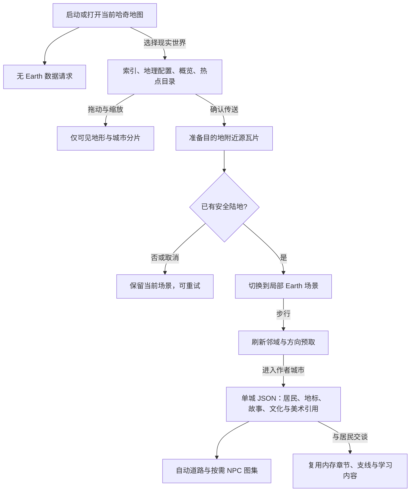

## 2026-10-03：按装备战力评估旷野难度

角色装备面板显示原版 GetGearScoreV2 战力，换装比较也提供战力变化；怪物场景名称和战斗登场显示对应战力。评分综合超级魔力率、五系最高攻击和平均防御，包含实际装备、强化、宝石、坐骑及成长加成，魔法星使用当前已验证状态；生命、暴击、卡组和临时状态不属于该原版指标，因此战力作为难度参考，等级仍控制技能和基础生命。

野怪以当前玩家战力为基准，距最近城市类地形（原始地类 urban）1500游戏单位以内目标为85%，12000单位及以上为130%，中间线性递增。城市名称、城市中心和聚落装饰覆盖不参与距离计算。裸属性战力最低200，目标最高默认10000；已有等级梯度继续保留。虚拟装备预算产生实际参与PvE的攻击、防御、超级魔力率及生命加成，不只显示战力数字，也不伪造原版装备GSID或新增装备掉落。预算与上限统一使用BalanceParams.earth。

新版 earth:wild2 遭遇编号保存目标战力，按相同规则重建装备加成；同一场未结束战斗不因后续换装而重新生成敌人。换装或强化改变玩家战力后，站在原地也会更新尚未挑战的怪物，种类、阶段与出生点稳定。旧 earth:wild 编号仍能恢复原无装备的敌人；旧战斗装备/怪物属性规则保留。

## 2026-10-03：非城市区域随机怪物

现实世界非城市陆地按已有局部逻辑块生成轻量出生点，每个1000单位块最多9个，采用3×3分区内的确定性随机位置；真实城市地类、海洋、水域、未知地形及道路/建筑/居民安全区不刷随机怪。城市范围内的草地、森林同样可刷怪，不再整片排除城市中心周边。随机出生点避让安全区40单位，既有剧情怪物保留。

出生点本身不创建战斗怪物、随机数状态或移动路径。视野附近复用AI角色的流送生命周期，最多6只活动野怪，进入时淡入、离开后延迟淡出并卸载；未显现及退场期间不触发挑战。淡入透明度通过共享场景状态进入Canvas，不逐帧重建空间索引或重置AI居民。刷新、升级或换装只更新需要的遭遇，种类、阶段和位置保持可复现。

随机池使用 pets.json 中359种四阶段宠物图集，不加入固定立绘怪物。种类与四阶段形态按块及槽位的独立种子抽取，四阶段等概率且不受玩家等级或宠物解锁等级限制；战斗等级以玩家当前等级为基准，按距最近城市类地形的距离递增（最终限制1–50），技能从该种类已达到等级的课程选取，生命、经验及仙豆沿用现有冒险试炼公式和BalanceParams。默认距城市类地形1500游戏单位以内低3级，12000单位及以上高5级，中间线性插值并取整；范围内没有城市类地形时使用远端难度。以全球锚定500单位网格采样原始地类，加载活动邻域外的远端难度范围，跨日期变更线按经度环绕计算。梯度、采样步长、密度和活动上限在BalanceParams.earth中配置。同一玩家等级下越远相对越难，达到等级上下限后保持封顶。玩家升级后即使站在原地，也会重新流送等级；同块种类、外观与位置保持稳定。

点击或靠近后沿用既有挑战、结算、捕获及30秒刷新规则。遭遇编号携带种类、等级、阶段、块和槽位，纯核心可在没有场景缓存时重建敌人，用于本机未结束战斗的校验/重演；不会向全局 content.monsters 累积流送对象。捕获后宠物成长仍遵循已有宠物规则。场景名称、地图标签、预加载及战斗开场图都使用该敌人及随机阶段，场景名称旁展示等级。战斗快速回归748/748通过，并在隔离浏览器场景确认深圳湾附近草地野怪可见；未做发布验收。

# 两个平行世界：按需探索地球

## 2026-10-03：城市街景 1.0

新增南头古城南城门—中山南街与深圳湾海韵园街景，两处均使用可追溯 OSM 道路/占地/岸线和透明 WebP 街景资源，每处 6 位可交谈居民；默认城市升级连续街道生成版本 2。深圳湾保留既有节点及任务身份，其他旧副本继续兼容原渲染。下面较早的三节点、原生 Canvas 布景说明记录本轮之前状态。当前数据范围、艺术补全边界及技能入口见 [城市街景 1.0](city-streets.md)。

## 2026-10-03：城市大地标与节点生活副本

深圳大地标现在管理蛇口海上世界、华强北和深圳湾公园三个独立节点副本，仍以 `cities/shenzhen.json` 为唯一作者源。现实地面有深圳总入口与三个地点入口，总入口进入城市总览，节点可从总览或现实地图直接进入；两种方式共用完成记录，退出返回实际来源。城市总入口按1–5级显示不同大小、颜色与环纹，深圳目录为一级；这个级别不决定怪物战斗难度。

城市配置的 `nodes` 是明确绑定列表，支持已有作者地标和源CSV命名节点。作者地标身份含所属城市，CSV节点按源ID全局查重；范围仅用于加载候选，不自动接管附近节点。没有配置副本的地标保持原有展示。索引新增 `dungeonIds` 轻量路由，城市正文不会进入启动包。

蛇口提供访客问路、导览卡拿取和交付；华强北提供导线/灯泡收集、组合、维修检查和照明；深圳湾提供规则阅读、望远镜观察、记录交付和步道照明。全部使用自由俯视行走、既有角色/宠物与本城NPC图集；生活布景和五档法阵为原创原生Canvas，不新增位图或资源上传。水面与建筑背景有配置障碍，设施完成后改变颜色。地点特色与生活流程为游戏改编，不是完整测绘还原。

本地居民主要中文，访客主要简单英语，中文释义可隐藏。语言课程沿用已有中英文字、主动录音、示范与共享奖励，不强制学习才能战斗。华强北和深圳湾完成相关生活准备才出现已有kids怪物，使用真实战斗与原有奖励；失败或撤退可重试，胜利才解锁最终设施操作。城市生活互动不新增正式物品、币种或掉落。

节点动作、场景道具数量和战斗胜利保存在 `earthCityProgress.cities[cityId].dungeons[dungeonId]`，属于records；坐标、返回链、未结束战斗及活动副本运行缓存仅在本机。云端单独恢复仍回营地，保留故事记录；冷启动先按轻量路由加载本机活动节点，再校验/重演。既有深圳主线和支线不变。

生成或更新其他节点使用项目 [城市副本生成技能](../.github/skills/haqi-generate-city-dungeons/SKILL.md)，契约见其引用。`scripts/update_earth_city_node.mjs` 支持只检查及显式写入，检查既有事件/学习身份并同步路由；不生成运行时AI依赖。隔离预览入口为 `tests/fixtures/city-dungeons.html?city=shenzhen&node=shekou`，可选择其他已经配置的城市/节点，角色仅在内存。

右上角地图按钮直接显示当前区域地图：哈奇场景显示当前岛屿，地球场景显示现实世界地图。地图标题旁的「哈奇世界 / 现实世界」页签直接切换两张并行世界大地图，无需先打开选择窗口。玩家与宠物保留同一角色、背包、成长和已有岛屿进度。现实世界使用连续经纬度空间，地图传送先准备安全陆地，成功后才替换当前场景；关闭地图取消加载，失败可以重试。进入已加载的河流或海洋时自动乘船，回到陆地恢复原有陆地外观；仍可用地图跨海传送，未知地形不可通行。

本文记录当前实现，不代表游戏已发布。实现入口见 [整体架构](architecture.md)，逐轮检查见 [QA 记录](qa-report.md)。内容维护者可从下方「维护深圳内容」开始；网络与缓存问题见「故障定位」。

## 2026-10-03：完整地表与植被表现

外景细节进一步烘焙进地表分块：按地类加入小砾石、草屑、林地落叶与雪地暗点；公路加入细颗粒、斑驳磨损和标线，路肩取周围地面的颜色并向外渐隐。道路与地面在同一纯核心中合成，单Worker处理；桥梁仍单独绘制，碰撞与源水体分类保持原有行为。可调强度、间距、密度、路肩宽度和磨损浓度统一在BalanceParams.earth。

镜头仍在同一批分块内移动时复用队列顺序；完整烘焙覆盖后不再逐帧重画道路。场景物件生成按时间预算主动让出主线程，行走与寻路用局部道路/建筑碰撞索引，流送对象版本变化时刷新；沿用原有道路通行优先级和桥梁边界。新增细节不占场景物件名额，不改变怪物或植被随机流。隔离预览 tests/fixtures/earth-biomes.html 提供混合地面与公路样例，tests/fixtures/earth.html 提供沿附近道路的8秒步行采样。

荒漠地面改用既有地形图集第二行第一格的细沙、零散砾石纹理，替换原来的灰色碎石格；底色与未加载图片时的兜底统一为沙褐色，接近戈壁沙地。复用既有本地WebP与永久CDN，无新增图片请求；土地覆盖分类、通行与装饰规则保持原有行为。

对照 apps/official/apps/helloworld/WorldConfig.js 的 TERRAIN_COLORS/TERRAIN_SKINS 及 TerrainTileManager.js 的 decorationConfig，现实地面保留全部10种源分类：海洋、水域、森林、草地、城市、耕地、灌木、荒漠、雪地、湿地。海岸沙色为过渡表现，不新增地表分类；城市仍使用已有独立地面纹理。这里支持的是二维土地覆盖表现，不移植三维高程。

雪地使用已有雪地纹理，并生成积雪松树、雪岩和雪堆；耕地以麦穗为主，城市保留花丛、草丛与稀疏树木，湿地使用芦苇和湿生植物，荒漠与灌木地分别使用石块和干草。森林的基础树木、额外密集树木及散布装饰统一使用纬度分带；棕榈只出现在低纬，寒冷森林仍是绿色针叶树，只有源分类为雪地时才附加积雪，不以纬度虚构季节。

surface-art.json 的 biomeDecorations 补充8格透明WebP：积雪云杉、积雪冷杉、积雪灌木、雪堆、麦穗、仙人掌、柳树、红树林。图集1024×512、197850字节，已上传永久Keepwork CDN；完整提示词保存在 assets/adventure/earth/source/earth-biomes-spec.json，准备脚本为 scripts/prepare_earth_biome_art.py，清单记录原图/WebP各自哈希与逐格裁剪。优先绘制WebP，图集尚未到达时积雪树、雪堆及麦穗保留 js/adventure_earth_decoration.js 的原生Canvas兜底。雪地使用雪树/雪灌木/雪堆/雪岩，低纬荒漠和灌木地可生成仙人掌，低纬湿地用红树林、温带湿地用柳树；植物配置为游戏美术近似，不代表生态调查。预览 tests/fixtures/earth-biomes.html 默认使用CDN，?assets=local 检查本地归档副本。地表与植被映射仍在纯核心模块中，浏览器绘制交给 surface painter。基础森林树种使用独立种子，保留既有遭遇随机流；装饰仍使用独立流，并保留道路、建筑、居民安全区避让。未知分类不生成草木，海洋与水域不生成陆地植被。

## 玩家旅程与当前范围

1. 点击右上角地图查看当前区域，使用顶部「哈奇世界 / 现实世界」切换大地图。
2. 现实世界图册可以拖动和缩放；城市名称可以直接点击，点击圆点附近会选择48屏幕像素内最近的可见城市（`BalanceParams.earth.mapCityPickRadius`），没有城市则清除选择并提示，不以空地作为点击目的地。圆点在手机和放大后都保持屏幕尺寸（普通直径12px，剧情直径16px），附深色边框。小于8屏幕像素的触摸抖动保持点击，不移动地图。选择深圳热点可抵达安全集合点；城市传送仍先检查实际已加载地表。缩到最小时地图上下居中并锁定纬度，保留左右拖动；放大后可在底图纬度范围内上下移动。
3. 与林澄交谈，按照章节提示寻找蛇口、华强北和大鹏的居民。地图可定位下一站，长距离旅途无需全程步行。
4. 比较居民提供的消息，确认城外目标后参与防御，再返回报告。错误推理选项给出提示，不扣除进度；可选语言练习沿用现有学习流程。
5. 随时从哈奇地图返回原有岛屿。角色、宠物、物品和成长属于同一份存档。

目前的精修范围是深圳六地标、8位居民、一条章节与3条交谈支线；其他城市使用真实城市位置及确定性的游戏建筑、道路、植被和伙伴。建筑不是逐栋真实复原，AI 伙伴沿用已有社交能力，不能将其视为当地真人在线。历史记忆为明确标注的虚构角色演绎。

## 加载边界

现实世界全球图册使用带国家区分色和国界线的 WebP 底图，来源为 Wikimedia Commons 的 `BlankMap-Equirectangular.svg`（Natural Earth 数据，CC0）。等经纬度投影与原概览范围保持一致：西经180至东经180、南纬60至北纬85；原512×211比例的底图提高为2048×844，文件33550字节。地图窗口仍为900×470画布，城市传送点按经纬度独立叠加，不烧进图片。缩放关闭 Canvas 平滑插值并使用像素化显示；全球图册放大时保留国界底图，不以地形瓦片覆盖。城市地图和传送安全检查继续使用原地表数据。

清单 `geography.json.overview` 记录本地WebP、实际上传成功的永久Keepwork CDN URL、尺寸、范围、来源许可及原SVG/WebP各自的SHA-256。默认读取CDN，明确的 `?assets=local` 读取归档副本。准备脚本为 `scripts/prepare_earth_political_map.py`；此图按用户2026-10-02允许的500000字节预算检查，其他资源预算保持原约定。图片不收入网站发行包。

全球图册以世界索引中配置了城市正文 `manifest` 的区域标识剧情城市：匹配城市编号或其经纬度位于该区域内的城市使用金色圆点并显示名称，其他城市使用浅色圆点。所有圆点都有深色描边，选中圈也有深色外边，避免在国家底色上难以辨认；地图绘制无需为判断剧情额外下载城市正文。

城市公路穿过短河段时自动铺设木桥，桥面与道路同宽、沿原曲线连接两岸，复用哈奇木桥的木板、侧梁和水面阴影。完整路线先按 `roadSampleStep` 采样桥面中央及两侧，再裁剪至活动邻域，避免河段跨多个道路分段或视野边界时漏建。两端必须是已加载且整幅桥面落在陆地上的河岸；沿道路跨水距离（含岸端采样间隔）默认不超过 `BalanceParams.earth.cityBridgeMaxSpan = 480` 游戏单位。宽水面、海洋、未知数据和建筑阻挡不会生成桥梁；水体分类保持原状，仅桥面允许步行。桥梁是游戏道路设施，不代表真实桥梁位置。

启动与哈奇地图不请求任何 Earth JSON、地形、城市 CSV、人物、任务或美术。选择地球后才动态导入浏览器服务，读取小型索引、地理配置、低清概览和 HelloWorld 的轻量城市目录（核验时约 15.6 KB）。目录只用于地图热点；不会展开城市场景。

全球图册在各缩放等级读取轻量热点目录的全部等级，不设置每视野固定数量上限。按实际屏幕空间收拢相邻城市，密集地区优先常用大城市，稀疏地区的小城市保留，放大后自然展开；原目录包括努克、黄刀镇、伊魁特、乌斯怀亚等偏远目的地。剧情城市与当前选择优先保留，重复经纬度合并并优先作者城市编号。圆点默认间隔42屏幕像素，名称避让其他名称、圆点和缩放控件，不把看不到的隐藏点作为点击目标。相关参数为 `BalanceParams.earth.atlasMarkerSpacing / atlasMarkerRadius / atlasStoryMarkerRadius / mapDragThreshold`。放大全球图册不请求密集城市或地形分片，城市周边地图仍使用原详细数据。

当前城市周边地图仍在跨度小于等于10度时读取可见的20度城市CSV分片，小于等于4度时读取可见的2度地形分片；这些详细地图请求不加载人物、建筑或章节。海外目的地同样验证陆地。

进入场景后仅保持附近 5×5 个逻辑块，周围小圈及移动方向提前读取源瓦片。源瓦片是 HelloWorld 的最小下载单位，单个瓦片本身覆盖的地理范围较大，不代表加载其中所有场景。进入深圳覆盖范围才加载约26KB的独立 cities/shenzhen.json，包含本城建筑、居民、遭遇、章节、对话、学习、文化资料与美术引用。交谈复用内存，不请求单独故事文件。原始地理 PNG/CSV 不复制到项目。

`EarthCache` 合并同键请求，并发默认 4、排队上限 48、地形最多 12 片、城市最多 4 片、缓存预算 32 MiB。解码图片以像素内存计费，城市文本按解析后的保守估计计费。准备目的地时锁定当前场景的瓦片与美术，失败或取消不淘汰仍在使用的场景。远处条目淘汰；对象空间索引及怪物游走缓存随区域更新裁剪。地图保留低清概览，不创建全地球位图或寻路网格。参数通过 `BalanceParams.earth` 覆盖。失败地形保持灰色未知区域并阻挡移动，不变成虚构陆地或海洋。



传送准备和角色退出会更新服务的取消代次并中止请求。已命中缓存的 Promise 同样可能延迟完成，所以故事读取在返回前还会检查代次、当前世界和区域编号。离开作者区域清除当前章节引用，但不删除角色的持久章节进度；回到区域后从缓存城市包恢复章节，交谈直接读取内存正文。取消只使旧结果失效，不应把它写回新角色或新世界。

### 预算与坐标约定

数值来源为 [combat_params_core.js](../js/combat_params_core.js) 的 `earth` 默认参数。以下为当前默认值，调整时以源码为准。

| 参数 | 默认值 | 用途 |
| --- | --- | --- |
| `unitsPerDegree` / `chunkSize` | 24000 / 1000 | 经纬度到游戏单位的比例、逻辑块边长 |
| `activeRadius` / `prefetchRadius` | 2 / 3 | 活跃块半径、源瓦片预取距离 |
| `maxChunks` / `maxSceneCities` | 64 / 24 | 邻域生成硬上限、附近城市数上限 |
| `maxConcurrent` / `maxQueuedRequests` | 4 / 48 | 同时加载数、待处理队列上限 |
| `maxTiles` / `maxCityTiles` | 12 / 4 | 地形与城市分片缓存上限 |
| `maxDecodedBytes` | 33554432 | 缓存计费预算，不等于浏览器总进程内存 |
| `requestTimeoutMs` / `streamIntervalMs` | 20000 / 350 | 单请求超时、流式更新节流 |

坐标使用等距圆柱变换：`x = (wrap(lon) + 180) × unitsPerDegree`，`y = (90 − clamp(lat)) × unitsPerDegree`。经度范围为 `[-180,180)`，纬度为 `[-90,90]`。修改比例或块尺寸会改变本机位置解释和生成身份，需要另做迁移与日期线测试，不能作为无影响的美术缩放。

源地形按 2 度分片，城市 CSV 按 20 度分片。当前实现中的解析和键名规则位于 `adventure_earth_core.js`；`geography.json` 记录这些约定，不是可任意切换数据格式的适配器。低清概览只覆盖南纬 60 度至北纬 85 度，超出部分不能用概览推断地表，仍以实际分片可用性为准。

## 代码与数据边界

| 文件 | 责任 |
| --- | --- |
| `js/adventure_earth_core.js` | 经纬度变换、日期变更线、种子生成、局部道路裁剪、安全区、碰撞、章节顺序 |
| `js/adventure_earth.js` | fetch/取消、缓存与解码、地球提供器、按需城市组件校验、Canvas 地形绘制 |
| `js/view_adventure_earth.js` | 世界选择、地图、加载/重试、居民对话；通过回调交给 app |
| `data/adventure/earth/index.json` | 世界名称、热点、深圳地理范围及引用 |
| `geography.json` | 原始来源 URL、瓦片约定、坐标约定、地表分类颜色 |
| `generation.json` | 生成版本、可用怪物、复用建筑资源；密度和预算在 BalanceParams |
| `cities/shenzhen.json` | 深圳唯一作者源，包含 buildings、npcs、encounters、safeAreas、quests、sideQuests、dialogue、learning、art、languages、demographics、characterGeneration、culturalElements 与 cityView |
| `js/adventure_earth_city_config_core.js` | 单城配置校验、主线兼容迁移、支线接取/交谈/回报、任务标记与目标 |
| `.github/skills/haqi-populate-city/SKILL.md` | 可复用的城市资料、当地姓名、外观权重、文化提示词、美术与任务制作流程 |

经度是空间身份，世界横向环绕；纬度限制在两极。默认每度 24000 游戏单位，逻辑块边长 1000。路网和物件只保留当前邻域，寻路限制距离与搜索节点数。生成使用地理块/真实城市编号和生成版本作种子；不消耗战斗 RNG。进入深圳覆盖范围会抑制通用城市建筑，作者地标叠加在相同地理空间，无需切换场景。森林仍使用确定性植被。安全路面、建筑入口、居民和集合点周围禁止怪物出生与游走。

## 深圳章节与美术

六处美术地标为蛇口、深圳湾、平安金融中心、莲花山、华强北和大鹏所城。位置用于区域定位，按源地表分类调整入口；图片与占地是游戏改编，并非测绘建筑。地标避让与场景绘制使用自动生成的城市之间的游戏公路，不是准确街道图。

章节「一起守住回家的路」按 `arrival → memory → clues → defense → return` 推进：林澄介绍求助，蛇口历史记忆谈倾听与合作，阿米娜让玩家比较旧桥梁消息与新求助，巡路员陈海指出城外目标，胜利后回林澄处报告。错误选项提供提示且不推进。原始作者源为 cities/shenzhen.json，稳定 NPC 编号为 990001–990008；新增故事不混入原版岛屿任务导出文件。

袁庚以明确标注的「虚构历史记忆」出现；人物引用可追溯到 HelloWorld 的 `HelloCityConfig/zhCN/shenzhen.json`，台词为本作原创，不当作历史引语。未来居民承担防御故事，普通人的消息、修理与照料和魔法同样重要。会感知魔力的人前往魔法哈奇世界训练，再回地球帮助居民。

可选中文/英文表达复用现有 StoryChat、语音服务、学习奖励去重；主线不强制开麦。伙伴复用既有团队、关系、聊天与战斗能力；游客可以遇到 AI 伙伴，已登录账号仍走已有社交接口。没有新增实时多人服务器或自动翻译接口。深圳以外只有探索与社交，不生成任务。美术在开发阶段完成并上传，探索期间不会调用图片生成服务。

六地标共享 WebP 图集为 768×512、144888 字节，永久 Keepwork CDN URL 和 SHA-256 记录在 `cities/shenzhen.json.art.landmarks`。本地副本只用于明确的 `?assets=local` 模式。发行包继续只有 HTML/JS/CSS/配置 JSON，不打包图片或音频。

## 存档与验证

`earthCityProgress` 按城市/章节/支线隔离，随 records 云分片持久化；旧深圳 `earthProgress` 在首次推进时兼容映射并同步；地图位置、返回位置、血量、宠物状态与未完成战斗仍在本机运行时记录。云端单独恢复时回魔法营地，同机恢复保留地球位置。由地球进入副本的返回坐标也只存本机；没有该本机记录时回营地，已完成的副本进度保留。原岛屿存档无需下载 Earth 文件便能解析。

专项测试：`node --test tests/battle_earth.test.mjs`。浏览器隔离场景：`tests/fixtures/earth.html`，仅内存角色，显示 Earth 请求数与缓存大小；「防御演练」使用真实战斗规则自动执行，便于检验章节结算。现有回归使用 `npm run test:battle`；构建脚本将所有 Earth JSON 保留为独立文件，禁止收入启动 adventure 数据包。

地表来源是 HelloWorld 的真实土地覆盖和城市位置，不是高程或真实道路导航。未对全球每个源瓦片进行穷举可用性检查；服务器缺失的数据会显示不可用。当前深圳是原创的六地标游戏区域，并非深圳每栋建筑的完整数字复原。验证记录见 [QA](qa-report.md)。

## 维护深圳内容

所有运行时文件位于 [data/adventure/earth](../data/adventure/earth/index.json)。每城只保留独立 cities/<id>.json，引用相对于游戏入口解析；世界索引只保存范围与城市文件地址，地图浏览不会展开城市正文。

| 要修改的内容 | 修改位置与引用要求 |
| --- | --- |
| 热点与作者覆盖范围 | `index.json` 的 `hotspots`、`regions`；热点为传送候选，仍需运行时安全检查 |
| 地标 | `cities/shenzhen.json.buildings` 的稳定 `id`、`lon/lat`、`w/h` 与 `frame`；`frame` 必须存在于 `cities/shenzhen.json.art.landmarks.frames` |
| 道路 | `adventure_earth_transport_core.js` 自动生成城市连接，参数由 `BalanceParams.earth` 覆盖；在真实地表上验证水域与桥梁通行 |
| 居民 | `cities/shenzhen.json.npcs` 的稳定编号、位置、`frame`、`portrait`、`languages`、`dialogue`；肖像绑定本城共享图集，对话键必须存在于 `dialogue.stories` |
| 遭遇与安全区 | `cities/shenzhen.json.encounters` 的怪物引用、地理位置、`safeAreas`；集合点、道路和入口应避开怪物生成及游走 |
| 章节推进 | `cities/shenzhen.json.quests.steps` 中稳定 `id/event` 与目的地；对话事件必须引用现有步骤，顺序关系要做回归 |
| 美术替换 | `cities/shenzhen.json.art` 同步本地路径、永久 CDN、尺寸、裁剪、字节数和哈希；每张 WebP 不超过 200000 字节 |

城际道路由 `adventure_earth_transport_core.js` 生成，参数由 `BalanceParams.earth` 覆盖；调整后检查水域截断、地标净空及怪物安全距离。旧深圳道路 JSON 与离线生成脚本已删除。

2026-10-03：城际连接改用稀疏的相对邻域图，不再限制每城只选最近两个邻居。默认24000游戏单位内的城市对，如果存在第三座城市到两端的距离都小于这对城市的距离，就省去直接道路。该候选图包含距离上限内的欧氏最小生成森林，因此同一候选城市集内能够通过距离阈值连接的城市群不会再因最近邻数量而分裂；无需两两铺路，允许经其他城市中转。相同输入稳定生成，不根据地形加载先后选择替代边。

这不是全球实际通行保证：只使用已取得的邻域城市数据，城市集随流送范围变化；道路仍按真实地表截断，短水域沿用480单位桥长上限，海洋、宽水域及未知地形不强行连接，尚未实现绕行补路。按2026-10-03用户约定，地标和建筑不再截断城际道路，地标美术可覆盖在道路上方，已有道路优先通行规则保持生效。城市位置重合时不生成零长度道路。移除不再使用的 `cityConnectionNeighbours` 默认参数，其他距离、曲率、宽度和桥梁配置不变。

故事修改前阅读项目 [haqi-story 技能](../.github/skills/haqi-story/SKILL.md)。保留编号和作者源位置，使用简明对话；历史记忆不能写成真实历史人物的原话。美术准备遵循项目资源技能，不能把生成服务加入行走循环。

`validateRegion` 在场景文件到达后检查关键坐标、编号和美术/怪物引用；`validateStory` 在交谈文件到达后检查对话、步骤和学习引用。这些是运行时基础检查，不是完整 JSON Schema，也不替代地表可达性及浏览器检查。

### 扩展到第二个作者城市前

地理提供器支持每城一个独立 JSON。新增城市使用稳定 cityId、章节ID与支线ID；主线步骤交谈绑定 npcId，战斗绑定 chapterEvent，学习身份按城市隔离。世界索引只新增范围与 manifest。运行 node scripts/check_earth_cities.mjs 检查跨城 NPC 编号、美术哈希及契约；生成流程见项目 haqi-populate-city 技能。新增奖励仍需接入现有奖励校验，不只修改配置。

## 故障定位与验收入口

| 现象 | 优先检查 |
| --- | --- |
| 启动出现 Earth 网络请求 | `adventure_assets.js` 的启动入口、动态导入调用时机，以及 `package_runtime_data.mjs` 是否仍单独输出 Earth 文件 |
| 灰色区域或传送不可用 | 源 PNG 请求状态/CORS、实际瓦片覆盖、解码后的未知或水面分类；不要增加虚构陆地兜底 |
| 城市图片没有出现 | `cities/shenzhen.json.art` CDN、图集裁剪和字节预算；明确离线模式才使用本地 WebP |
| 对话迟到或显示旧城市章节 | 服务取消代次、当前世界引用、区域切换及 app 的角色/传送标记 |
| 行走中内存不断增长 | `EarthCache.bytes/entries/pending/queue`、局部对象数量、空间索引与怪物缓存裁剪；浏览器总内存还包含已有角色和战斗资源 |
| 深圳进度未推进 | 当前步骤、对话事件、选择是否正确、真实防御结算与返回报告条件；不要通过重复发奖修补进度 |

开发者可通过普通 HTTP 服务打开 `tests/fixtures/earth.html`，查看请求计数和缓存大小；隔离页使用内存角色。实际角色连续性还需在 `Haqi.html` 检查，不应以隔离页替代。

```sh
node --test tests/battle_earth.test.mjs
npm run test:battle
npm run build
```

每轮记录专项、战斗与构建结果；构建产物的 `data/adventure.json` 不应包含 Earth 键，当前 Earth JSON 应作为独立文件存在，dist 不含图片/音频。浏览器检查顺序为：启动零请求 → 哈奇地图零请求 → 图册 → 安全抵达 → 对话/推理 → 防御/报告 → 跨海传送 → 返回哈奇 → 本机刷新恢复。另查取消、失败重试、390px 布局和水面边界。真实账号云同步、真人社交和语音识别需要单独记录实际验证结果。

## 高清地表与地理装饰（2026-10-02）

现实世界场景不再把低清分类瓦片直接放大作为最终地表。参考 HelloWorld `WorldConfig.js` 的材质分层与 `TerrainTileManager.js` 的 splatting/海岸泡沫，新增原生 Canvas 地表合成器：真实土地覆盖仍控制碰撞和水陆身份，离线生成的美术只负责表现。没有引入 Three.js、全地球位图或运行时图片生成。

### 城市人口与建筑装饰

无剧情城市同样生成道路和交通街区。`adventure_earth_transport_core.js` 利用已加载城市坐标，在粗地类显示草地、耕地、裸地时提供有限的聚落布局覆盖：小/中/大城市半径为 550/900/1400 游戏单位。覆盖只供街区放置使用，不改变真实碰撞地类，不覆盖森林、水域或未知地块，也不扩展数据请求范围。通用街区替代旧的城市中心十字路与同款小房子。

每个包含城市中心的逻辑块最多生成一处交通街区；有多个城市条目时按人口和稳定编号选择。铁路仅落在可用聚落地面并避开保护区，短于 240 单位的零碎轨道不放站。车站旁有列车、信号灯、公交接驳点；人口超过 100 万使用现代高铁站与白蓝列车，并增加地铁入口。铁路、站点和周边建筑预留空间，站前集合点为安全区。当前列车为场景装饰，没有运行时刻表、乘车或运营模拟；所有线路是游戏化设计，不表示真实铁路。

`city-art.json.transport` 引用 8 格交通图集（普通车站、高铁站、公交站、地铁入口、普通列车、高铁列车、信号灯、备用高架构件）。WebP 为 114914 字节，记录原图及输出哈希、尺寸和永久 CDN；`prepare_earth_transport_art.py` 根据检视后的非等宽源格裁剪再打包。只加载当前场景实际使用的图集，地图浏览不会读取交通图像；高架构件目前仅作为后续美术储备。

本轮升级为街区生成：`adventure_earth_city_layout_core.js` 按固定 500 单位街区划分住宅、商业、公园，地表与物件共享同一个分区函数。商业区才出现高层/商铺，住宅使用公寓/别墅，公园以中央喷泉和周围绿化成组布置。500 单位网格生成城市支路、人行道，按真实 urban 分类截断，避开地标显示范围；这些是游戏改编道路，不是测绘街道。路灯/电线杆沿街边排列，建筑留出退距；密度配置更新为 0.70/0.88/0.98。

地表合成采用一个原生 ES Module Worker（`adventure_earth_surface_worker.js`），图集初始化复制一次，任务只发送当前块的小型地类快照；完成后的 RGBA 数组转移给主线程。始终最多一个在途任务，旧视口/失效任务不提交，离开地球时终止 Worker。无法启动或执行失败时回退到每次一行、约 2ms 预算的主线程分帧路径，不依赖 OffscreenCanvas、SharedArrayBuffer 或第三方库。四核及以下或报告内存不超过 4GB 的设备使用 192 像素地表块，其余为 256；这是负载分档，不代表已在实体手机完成性能验收。

地形分类解码改为直接颜色距离计算并分批让出主线程；高频 terrainAt 查询不再反复更新 Map 的 LRU 顺序。场景物件每三个逻辑块让出主线程，先构建临时数组，检查旅行代次后统一替换，避免走路时半成品场景被渲染。启动与地图浏览仍不加载场景 Worker 或城市图集。

`adventure_earth_city_core.js` 根据已加载城市 CSV 的 population 字段选择小城、中城和大城配置。默认阈值为 10 万、100 万；缺失人口用保守的小城配置，不编造人口。最近城市的影响范围为 12000 游戏单位。每个 1000 单位逻辑块划分 6×6 固定候选格，密度分别为 0.70、0.88、0.98；仅真实 urban 分类且建筑基底采样仍是 urban 时放置。固定格种子包含生成版本和地理身份，访问顺序不改变结果，日期线两端保持一致。候选格另外在固定街边锚点放置路灯或成对电线杆，保持水域和安全区过滤。

新增 `city-art.json` 独立清单：16 格建筑图集（高楼、公寓、联排住宅、别墅、学校、医院、市场、图书馆）和 16 格街景图集（路灯、电线杆与电线、候车亭、报刊亭、长椅、喷泉、花坛、公园、竹园、棕榈、游乐场、凉亭、自行车、分类垃圾桶、花门）。分别为 177864、189842 字节，保留透明通道、裁剪和来源哈希，默认使用已验证的 Keepwork CDN。独立打包脚本为 `scripts/prepare_earth_city_art.py`。

只有抵达场景包含城市装饰时才请求这份清单及两张图集；启动、打开当前岛地图和浏览地球地图不加载。建筑与街景同样参与 Y 排序；街景标记 decorationOnly，不阻挡通行。深圳范围内的 urban 地表也会生成街区，实际地标、道路、入口、居民和安全集合点周围排除放置，不再让整片深圳只剩几个地标。原先城市中心的简易房屋仅用于非城市、非森林的已知陆地。

所有新增参数在 `BalanceParams.earth`：`cityPopulationLarge/Medium`、`cityDensities`、`cityInfluenceRadius`、`cityCellsPerChunk`、`cityStreetFraction`（0.28）、`maxUrbanObjects`（1800，覆盖默认 25 块各 72 个候选物件的上限）。森林另有 `forestDecorationsPerChunk`（100）候选树木，沿用独立装饰随机流，不改变怪物身份。物件只保留活动块范围，安全区和水域过滤仍生效。

城市地表使用第 14 格石砖铺装，在地表块内烘焙纹理和地类边缘过渡，不再使用第 1 格草地。街灯、电线杆仍以物件排序绘制，避免高处物件烘进地面后错误遮挡角色。地标按原图裁剪宽高比等比缩放；根据完整 authored 道路集合寻找不与道路重叠的已知陆地，候选搜索与相机位置无关。参数 `landmarkRoadClearance=20`、`landmarkPlacementStep=60`、`landmarkPlacementRadius=900` 控制留空与搜索；找不到合法位置时不强行占用道路。

高清地表以当前可见块为最高优先级，再生成 `surfacePrefetchRing=1` 的周围一圈。队列总数与缓存均受 `surfaceMaxChunks=64` 限制，约 16.3 MiB RGBA。移动到预热块时直接使用已完成画布，方向变化丢弃不再需要的排队块；底层源瓦片仍沿用附近数据和行进方向的小范围预取。

2026-10-03 用户约定：现实世界禁止钓鱼，海洋、河湖、陆地及未知地形均不触发捕鱼，也不加载钓鱼玩法数据。只有 Haqi 世界点击水域才进入钓鱼，海岛沿用海岛轮廓规则，副本仍不开放。结算层同时拒绝现实世界捕鱼，不消耗渔网、精力或发放奖励。

- `adventure_earth_surface_core.js`：可在 Node 运行的确定性纹理采样、连续噪声、地类混合、浅水/沙岸/泡沫着色，以及地类和纬度对应的小装饰集合。
- `adventure_earth_surface.js`：可见块队列、分帧光栅化、有界 Canvas 缓存和装饰图集绘制；角色离开地球后销毁任务与画布。
- `surface-art.json`：预制 WebP 的本地/CDN 路径、裁剪、尺寸、源图与产物哈希。仅进入地球并实际绘制场景后加载；浏览图册不下载它们。

新增 16 格地表图集（草地、林地、沙岸、岩地、海洋、浅水、河水、湿地、雪地、耕地、铺地等）和 16 格透明装饰图集（榕树、棕榈、针叶树、落叶树、灌木、蕨类、芦苇、草丛、岩石、花草、蘑菇等）。两张均为 640×640，分别 197206 与 165646 字节，使用永久 Keepwork CDN。原始生成图保留，打包脚本 `scripts/prepare_earth_surface_art.py` 校正不等高的源行、留透明边距并逐级编码到 200000 字节内。

纹理在采样前进行周期接边混合，避免镜像重复形成对称花纹；块边缘包含相同的额外像素，避免 Canvas 缩放时出现细缝。水陆混合在邻近分类之间进行，使用连续噪声打散边界，水面叠加深浅色与细纹；未知分类仍显示灰色，不会用美术伪造陆地。城市地表是游戏化覆盖，不是准确街道。低清地类原有轮廓精度不会因为新材质而提高，极小水域仍可能呈现源栅格形状。

装饰使用独立的 `earth-deco:1:块编号` 种子，不消耗怪物生成随机流，不改变碰撞。根据真实地类及纬度选择热带/温带/寒冷环境的美术；这只是游戏美术规则，不是精确生态调查。水域、安全路面、建筑入口和居民周围不放置新增装饰。

### 地表缓存预算

参数仍通过 `BalanceParams.earth` 配置：

| 参数 | 默认值 | 说明 |
| --- | --- | --- |
| `surfaceChunkSize` | 256 | 单块覆盖的游戏单位 |
| `surfaceResolution` | 256 | 块主体光栅边长；另加两像素边缘 |
| `surfaceMaxChunks` | 64 | 完成块数量上限，约 16.3 MiB RGBA 画布 |
| `surfacePrefetchRing` | 1 | 当前可见区域之外预热一圈，受总缓存预算限制 |
| `surfaceFrameBudgetMs` | 4 | 每个生成时间片的协作预算，单次两行运算/Canvas 提交不可中断 |
| `surfaceTexturePeriod` | 192 | 材质在游戏空间中的重复周期 |
| `decorationsPerChunk` | 80 | 单个逻辑块的装饰候选数，安全与地类过滤后更少 |

源瓦片/图集仍受原 32 MiB 数据缓存约束；细节画布另有上述数量上限。当前生成任务最多一个，等待队列只保留可见块，远处任务直接丢弃。低比例小地图或超出块预算的大范围视野使用低清底图，不展开全球细节。预算不是浏览器总进程内存上限，也不保证所有设备恒定帧率。首次细节准备时短暂显示已有底图，图片失败不改变地表碰撞，可重试获取材质。

验收页的「地表状态」按钮显示块数、队列、画布字节数、图集就绪状态和最大生成时间片。新增 `tests/battle_earth_surface.test.mjs` 检查整幅/分块像素一致、跨日期线噪声、未知数据、持续移动缓存上限、资源大小与哈希、地类/纬度装饰以及材质接边。视觉需另查深圳湾海岸、城市街区、森林、手机尺寸和移动后的块接缝。

## HelloWorld 城市底图与流送稳定性（2026-10-02）

已定位 HelloWorld `WorldConfig.js` 当前启用的 `https://cdn.keepwork.com/helloworld/tileset/city02.png`（512×512）。旧注释描述过 4×4 人口分级图，但当前配置是 `tileSize:8, random:false`；本项目复用完整底图，不把旧注释当作当前裁剪布局。来源不是深圳真实街道测绘，纹理内道路、楼群、农田和水池仅为装饰，实际水陆碰撞仍由真实地类决定。

`surface-art.json` 的独立 `cityGround` 条目记录原图及 WebP 哈希、尺寸、本地副本与永久 CDN。无损 WebP 为 120730 字节，仅进入地球场景后加载；Worker 和主线程回退均按地理坐标采样，在 urban 地类混合细小街区纹理。`BalanceParams.earth.cityGroundPeriod=768` 控制重复尺度；`cityDrawSceneRoads=false` 默认关闭此前角色尺度的灰色城市马路，保留剧情步行路线和导航安全区。纹理会重复，并不代表真实街网；草地上的城市位置暂不强制改写成 urban 地类。

加载周边场景时，建筑数组和对应的绘制函数一同暂存，资源就绪且 epoch 有效后再一起替换。地球图片缺失不再回退到海岛精灵图集，避免建筑短暂变成樱花树。资源失败保留错误/重试提示，不使用错误的替代图。


## 2026-10-02：高清街区、城市公路与明亮地表

城市底图改为一张独立 AI 重绘的连续街区（1254×1254，原图512×512），切成四张627×627 WebP分别编码，每张177566–186424字节，均已上传并核验永久Keepwork CDN文件哈希与CORS。它不是4×4随机格图；加载时合成连续纹理，裁剪边界保持原画连续。来源与旧HelloWorld参考哈希分别记录在surface-art.json，准备入口为scripts/prepare_earth_city_ground.py。原图总像素约为旧底图6倍，并非简单放大旧图。地表块覆盖尺寸从512缩为256游戏单位，桌面保持256像素采样，画布总预算仍约16.3MiB；移动端保持192像素。

移除场景中的横直铁路、铁轨枕木及列车街区。城市按真实经纬度选择两个近邻（默认24,000游戏单位内），用轻弯曲线生成局部公路；不依赖额外交通接口。道路裁剪到当前区域，逐段排除已知水域、未知地表与精修建筑；它们是游戏改编路线，不代表真实道路，跨海处不补桥。连接区域中途步行也保留可见道路。2026-10-02 调整为默认52单位宽的浅灰米色路面，4单位浅米色路肩和8单位渐淡边缘，连续描边衔接弯道，弱纹理和浅虚线使人物更清晰。深圳旧作者道路仅保留来源归档，不再加载、绘制或参与地标避让；场景道路统一采用城市之间的连接，城市底图自身的细街巷作为背景保留。

草地、森林、农田、湿地采用明亮黄绿色基色，并混合62%日光植物色，保留原纹理细节、地类边界和水域颜色。surfaceVegetationTint与cityConnection*全部通过BalanceParams.earth调节。本轮不修改地理数据、战斗公式或存档格式。

### 当前城市地图（2026-10-02）

现实世界场景的地图按钮默认打开当前城市周边图。范围使用已加载邻域（chunkSize × (activeRadius + 1) × 2），主角居中；以纯色块呈现大致地貌，叠加既有道路、真实城市节点与当前位置，不加载全球数据或绘制场景建筑。城市节点沿用现实世界旅行入口。地图顶部两个世界按钮打开全球地图；全球地图返回入口在现实世界中显示返回当前城市地图。实现位于 js/view_adventure_earth_local_map.js、adventure_renderer 的 minimap 简图分支及 earthLocalMapBounds。

2026-10-02 后续优化：城际公路收窄为52单位，并剪去密集城市三角连接中的冗余长边，保留经更近城市连接的短边，减少汇合成大片路面的情况。城市与地标名称在场景中以固定屏幕字号绘制，避让人物与其他地名；城市细街巷仍属于背景。

当前城市地图支持鼠标、触屏拖动与方向键平移，地图、道路和城市节点同步移动；拖动仅改变查看范围，不改变玩家位置，按视野读取地形切片和城市数据，拖动结束不会触发传送。

城市地图拖动时通过 localViewport 加载视野内真实地形切片与城市数据，并按既有规则生成该视野道路；请求节流、缓存复用，不创建或替换游戏世界。地名按 earth_map_labels_core 的确定性避让排列，连线终点保持真实城市坐标；密集到无法容纳全部文字时保留可点击圆点与地名悬浮说明。右下角定位重新居中到角色位置。网络失败显示重试按钮，不把未知地形伪造为已加载地貌。

### 2026-10-02：地球地形斜边绘制

场景详细地表按 HelloWorld marching squares 的边中点和三角轮廓构造材质权重；植被与城市染色沿相同轮廓，避免原始源格边界再次露出矩形。仅改绘制，源地类继续决定通行。对角鞍点采用固定连接方向，多地类中心复用局部纹理混合；分块和 Worker 使用相同实现。

### 小幅移动与流送稳定性（2026-10-02）

进入地球时记录已生成的逻辑块，正常同块移动不会额外重建。跨块时邻域候选仍按确定性规则生成，提交时复用重叠区域内未改变的建筑、树木、NPC与道路，不重置其附加运行状态；没有物件变化的重试不会通知空间索引和社交刷新。新源地形只使采样覆盖范围内的地表块过期，原图继续显示，替代图就绪后逐块交换；不清空其他已绘制地表。全量缓存清理仅用于更换世界对象或退出，Worker过期结果不进入新场景。

### 2026-10-02：保留斜边并恢复原混色和海岸

按用户反馈，将斜边材质权重的混色跨度从 0.12 恢复为原来的 0.7 单元；直线交界与旧版 smooth((u-.15)/.7) 一致，斜角仍沿 marching squares 轮廓。既有浅水、沙边、浪花公式不变，重新获得原先宽度的过渡区域。植被和城市地面继续沿同一权重着色，避免矩形硬边回归。

### 2026-10-02：连续圆滑海岸

针对直线斜边在水岸形成尖角，水陆邻域改用 4×4 非负三次 B 样条权重，跨源格边界连续，并将同一权重用于地面材质、植被、浅水、沙边及浪花。纯陆地保留 marching squares 斜边；通行仍按原始地类。邻域分类按栅格单元缓存，不新增地图请求、图片或逐帧计算。很小的孤立水格在视觉上会变柔和，源通行分类不改变。

### 2026-10-02：只圆滑轮廓，恢复细岸线

用户进一步明确岸线本身应保持原状，仅圆滑转弯。上一版将 B 样条权重直接用于着色，导致地面/浅水混色带变宽。本轮保留样条的圆滑轮廓，着色前反解样条直线阶跃响应，再套用原 `.15–.85` 混色曲线；直线岸边的浅水、沙边与浪花权重恢复原值，减少水岸外围大范围雾状混色。样条仅决定轮廓弯曲，既有颜色和海岸公式不变。

### 2026-10-02：最终选择恢复斜边拐角版

用户比较后选择带拐角的旧版。当前地表已恢复到「保留斜边并恢复原混色和海岸」的实现：四角 marching squares 斜线轮廓、原 0.7 单元混色，以及原浅水/沙边/浪花。撤除后两轮 B 样条海岸圆滑和响应反解；上方两条圆滑海岸记录仅为历史方案，已不在运行时使用。保留分块一致性检查，其他地图和缓存工作不变。

### 2026-10-02：尖角局部微圆角

最终用户要求仅将很尖的海岸角稍微圆润。当前在 marching squares 线段相接处使用半径 0.08 源格的局部距离平均，只对水陆权重施加微小差值；直线距离平均保持原值，斜边中段不处理。仍沿用原 0.7 混色曲线和浅水、沙边、浪花公式，不恢复整岸 B 样条。未知邻格不调整，通行不变。


## 深圳居民与单城配置（2026-10-02）

居民包括林澄、袁庚历史记忆、阿米娜、陈海、陈梅、黄磊、亚历克斯与玛雅；共享透明 WebP 1024×640、139356字节，永久CDN与源/输出哈希位于 art.npcs。人物按安全陆地落点显示，离开城市释放共享角色图片。交谈沿用岛屿 rpg-dialogue 界面、肖像、共享关闭按钮；提供任务接取/目标交谈/回报、主线、自由交谈、可选中英表达及配置指定的地图/背包/玩家宠物入口。自由聊天复用既有服务，不新增聊天后台。

三条日常支线为「一张能看懂的路线图」「把问候带给新邻居」「安静观察的小约定」；完成仅记录经历，不额外发放货币。目标不在当前邻域时，可通过世界地图前往。主线和支线互不要求完成对方；主线战斗继续由真实结算推进。新增记录放 records 分片，位置仍仅本机。

普通话为主要交流语言，粤语、英语和客家话分别保存资料来源；每个人常用语言独立配置，标签不表示已支持该语言的语音课程。demographics 保留2015年官方抽样民族分类（汉族96.02%、少数民族合计3.98%），明确不是最新人口或肤色比例；characterGeneration 外观权重为游戏创作（东亚常见外观0.8、浅肤色欧洲背景0.1、深肤色非洲背景0.1），不是人口统计。固定8人阵容不要求严格按百分比采样。

文化素材保存簕杜鹃、红树林、黑脸琵鹭、大白鹭的来源和图片提示词，cityView 保存深圳风貌提示词；目前用于故事及后续美术准备，未生成新的环境物件。参考 HelloWorld MapCopilot.js 的文化、城市风貌、当地姓名、NPC与剧本提示词组织方式，不在游戏运行时请求生成。


### 2026-10-02：城市社交 AI 按视野驻留

地球社交名单与活动实例分离：城市刷新只更新轻量候选落点，`adventure_social_stream_core.js` 根据玩家距离和相机范围创建活动实例。`BalanceParams.islandSocial` 默认最多 6 位活动社交 AI（包含队友及正在淡出的角色），入场 0.8 秒淡入，退出 0.5 秒淡出；人物、姓名、动作残影及随行宠物共享透明度。

普通角色只在玩家 1000 世界单位内、相机范围加缓冲区时入场；视野外保留 1.5 秒以免边缘抖动，之后淡出卸载，超过 1200 世界单位直接卸载。城市候选名单变化先淡出旧角色，空出的名额再接纳新角色。队友优先且不因视野或距离卸载。释放活动角色后，渲染器清理姿态、残影与跟随缓存，宠物场景清理相应访客及运动实例；候选只保留身份、落点、朝向和活动中心。岛屿及作者任务 NPC 保持原有流程。

验证：专项 38/38、快速战斗回归 669/669 通过；本轮未启动浏览器、构建或发布，视觉观感待浏览器确认。

### 2026-10-03：小型 WebP 城市传送点与默认街区

城市地面入口改为 entrance-art.json 中已有 shared/elite 石质蓝色法阵，保留透明 WebP 与永久 Keepwork CDN；不再绘制大面积动画圆环。城市等级仍控制48–64游戏单位宽度和地名颜色，专属节点入口宽46，接近52单位的道路宽度。法阵作为静态地面层绘制在居民、玩家和宠物之前，目前没有写入地表切片像素缓存。

附近城市CSV命名节点提供默认传送点；单城配置的总入口及明确绑定节点优先使用作者内容，深圳现有专属场景保留。没有专属内容时，adventure_city_generated_core.js 参考HelloWorld City View的九乘九街区、十字道路和中心站点组织方式，用独立种子随机安排已有房屋与绿地，无运行时生成服务请求。三处挑战可自由选择，等级按玩家与准备队伍最高等级安排，怪物数量参考队伍人数，复用已支持的儿童版怪物、试炼生命和奖励。

默认城市来源、布局种子、挑战等级及人数放在本机cityFallback路由，冷启动能重建相同场景；胜利记录仍按城市与副本进入records分片。专属/默认场景共用加载取消保护、真实战斗结算和原入口返回。生成技能只负责开发期制作专属内容。


## 2026-10-03：地球移动渲染与小物件烘焙

低矮地理装饰（草丛、岩石、灌木、花草、麦穗、雪堆等）现在按真实精灵和软投影的覆盖范围合入相交地表块。高树继续参与 Y 排序和遮挡淡化。邻域流送仅使变化装饰相交的块过期；空间索引浅复制以稳定绘制身份命中，已烘焙物件退出逐帧排序，跨块物件的临时绘制裁剪到尚未烘焙的部分。

支持 OffscreenCanvas 时，单个原生 Worker 使用一次克隆的装饰图集合成地表、道路、小物件和投影，并转移成品 ImageBitmap；主线程直接缓存和绘制。合成能力缺失或失败时仍由 Worker 生成像素，Canvas 上传与装饰绘制使用已有分帧路径；Worker 本身失败时沿用有预算的逐行回退。完整覆盖后不再绘制底层源地形和临时道路。缓存数量与像素预算保持原值，替换、淘汰、过期结果及退出都显式关闭 ImageBitmap。

本轮快速回归758项、补充后地表专项29项通过；尚未新增实际设备帧时或 FPS 采样。验证范围见[QA记录](qa-report.md)。


## 2026-10-03：低开销昼夜、模拟天气与缓存优化

现实地面及城市副本接入 `adventure_earth_environment_core.js` 的独立视觉规则；参考 HelloWorld WeatherService 的暖色晨昏与蓝紫夜景，日照按 UTC 时间、经度和纬度估算季节太阳高度。设置 → 游戏提供当地日照 / 白昼 / 黄昏 / 夜晚，以及模拟天气 / 晴朗 / 雨 / 雪 / 雾 / 风沙 / 关闭。模拟天气按半小时地理区域及地类确定，不是实时天气预报，没有天气网络请求；独立 RNG 不影响世界生成、战斗或存档。偏好仅进入设备设置数据库。

默认保持白昼、晴朗，自动日照及模拟天气需用户在设置中主动开启。旧版自动默认迁移一次为白昼晴朗；迁移后手动开启自动选项可正常保留。持续拖动缓存画布边界并在窗口变化时更新；伙伴网格寻路使用稳定最小堆，避免每次扩展排序整个候选队列。实际验证范围见QA记录。

现实地面与城市副本左下角显示 FPS 和平均帧间隔，每半秒更新一次；暂停界面、隐藏或长时间未绘制后重新采样，不上传数据。镜头移动复用扩展128单位的静态视野列表，越过边缘或对象索引失效才重新查询/排序；活动角色单独排序，与静态景物按Y合并，保留遮挡和场景绘制裁剪。碰撞查询继续使用精确范围。

光照用最多两次透明颜色覆盖，不改变地表缓存；夜晚保留道路和角色可见性，最多12处建筑门前暖光只复用一张64×64原生渐变。雨、雪、风沙共用48个预生成粒子，切换交叉淡入淡出仍不超过此预算；薄雾仅一次低透明覆盖。水面微光使用固定地面网格，视野单元/地形版本变化才查询水体（最多80处、160次查询），不落在陆地上。减少动态时停用天气和波纹；关闭场景粒子同样停用动态天气和波纹。

地表缓存稳定后不重建排队列表、不逐帧改写LRU，也不为空闲Worker安排pump。城市街景缓存上限由48张512²降至24张，远景倍率使用更大世界分块，避免可见工作集超过预算后反复重烘焙；低内存设备384²采样，淘汰和离场显式释放Canvas。持续低帧率的自动降档还将场景DPR上限从2降至1.25并暂停暖光/波纹；战斗独立画布不改。

验证与本机采样见[QA记录](qa-report.md)。没有引入新第三方库、CDN资源或天气服务；不修改真实水陆碰撞及人物进度。本轮保留本地修改，未提交、推送或发布。

## 2026-10-03：宽水域码头与自动乘船

- 城际道路采样保留短河桥梁（默认最大480单位）；较宽河流、海洋路段保持水面，在有已加载陆地的道路岸端生成四向码头。没有城市道路的任意岸线不额外铺码头，未知地形不当成水域。
- 地球玩家可通行已加载water/ocean，桥面仍步行；船状态由当前地形即时推导。人物进入水面自动显示四向木船并隐藏腿部，上岸恢复原陆地外观；不新增正式坐骑物品、不修改mountId或云端收藏，已有装备保持。队伍跟随者在水上同样显示船，闲逛AI与怪物保持陆地通行。
- 普通地图传送继续选择安全陆地；本机恢复和从副本返回调用prepare的restore模式，允许恢复水中坐标。地形未加载仍阻挡，继续沿用局部寻路距离与前方预取。
- boat-art.json登记8帧透明WebP（4船向/4码头向），94318字节，生成提示词、裁剪、源哈希和WebP哈希齐全；默认永久Keepwork CDN，?assets=local读取归档副本。资源仅在进入地球后登记，退出释放，不打入启动资源或dist静态图片。
- 美术由内置image_gen生成，scripts/prepare_earth_boat_art.py保留alpha并先尝试无损，最终quality94。CDN文件哈希与CORS=*已核验。隔离预览tests/fixtures/earth-boats.html使用真实人物渲染与寻路，只保留内存角色。

## 2026-10-03：连续行走的后台准备与增量切换

`adventure_earth_stream_worker.js` 按首次需要启动，承担真实地形 OffscreenCanvas 解码、像素分类、城市 CSV 解析和局部场景候选生成。`adventure_earth_scene_core.js` 复用原有生成规则、地理编号和 RNG 顺序；Worker 与无 Worker 回退运行同一生成器。回退在城市网格、道路采样、植被候选和最后整理阶段均可暂停，不再只在完整逻辑块之后让出主线程。

地形输入仅传送新分类；场景每包默认64行，收到主线程预算队列的应答才发下一包。稳定生成签名在 Worker 内比较，重复物件只发送编号，主线程保留原对象及其实时状态。主线程还复用静态绘制描述符，避免每次跨块重新分配整片重叠对象。分类、城市配置和规则版本决定静态缓存失效；玩家等级和装备战力仍刷新野怪数值，景物和遭遇身份保持原规则。

服务按移动方向提前准备邻块；当前区域、待切换区域和地表美术同时受缓存保护。数据请求、候选准备和活动区域提交分开，旧场景持续可见。暂存区按预算完成增量合并、碰撞和静态视野索引，帧边界只交换准备完成的引用。静态变化通知带 `prepared/staticChanged/collisionChanged/socialChanged`，兼容 `wildOnly`；野怪进出不会清空静态索引。地表仅使变化物件/道路覆盖的小块失效，旧位图显示到替换完成。社交落点及 Earth 宠物绕障搜索也使用同一准备预算，保留确定性路径算法。

消息含世界代次、请求编号与输入版本。快速转向、传送或离场使旧结果失效；离场终止 Worker、拒绝任务并释放位图。`createEarthService` 原有准备、更新、绘制及释放接口保持，新增 `workerFactory/scheduler/prepareAssets` 注入用于回归和故障回退；`streamStats` 提供本机诊断。请求并发、解码字节预算及美术质量保持现有值，没有修改存档格式、云同步或战斗公式。

新增参数均在 `BalanceParams.earth`：`streamBuildBudgetMs=2`、`streamPrefetchDistance=450`、`streamTurnCancelDistance=8`、`streamPacketRows=64`、`streamCacheChunks=192`、`streamRouteCacheEntries=64`、`streamUrbanSampleEntries=8192`。地表64块预算、纹理分辨率和景物密度不变。2ms是每帧准备目标；浏览器垃圾回收和单个原生调用仍计入实测，不把该参数当作通过保证。

运行时CPU采样另定位到宠物状态与绘制反复解析完整参数的分配开销。`resolveParams` 保留原接口与结果，完整解析每次只构造一份默认值；新增可选 `groups` 仅解析所需 BalanceParams 分组，缓存默认键表，避免每次生成大量键值数组。宠物热点沿用该入口，覆盖值原地变化立即可见，返回的默认数组保持独立，不改变战斗或宠物数值。碰撞准备同时生成安全区空间索引，避免怪物每次局部移动扫描整个邻域。

透明图集边界预热通过同一流送Worker的 `bounds` 消息完成 OffscreenCanvas 像素读回与分类；不可用时逐行加入2ms预算，取消释放临时Canvas。共用 `image_bounds_core.js` 的原透明阈值与裁剪坐标，绘制同步接口保持。社交候选外观与宠物在启用新名单前预热，保留活动名单直至准备完成；`hero_renderer.js` 在图片异步解码完成后才登记为可绘制，避免新人物首次绘制触发同步解码。暂存场景通过 `prepareAssets` 等待新增居民图集、透明裁剪和人物各方向源边界准备完成后才发布；城市图集按编号登记一次，离场释放。新图片不改变清晰度、裁剪或动画。

`?profile=1` 启用有界本机采样：帧 P95/P99/最大值、超过33/50ms次数、请求/解码/生成/应用/索引/地表/预热阶段及尖峰附近事件；主应用另记录宠物、社交、绘制和定时照料耗时。`haqiPerformance.summary()`、`.timeline()`、`.reset()` 用于检查，数据不写入角色存档或上传。

`scripts/check_earth_walking.mjs` 使用隔离浏览器角色、真实 CDN 数据与碰撞感知实际行走；默认城市和旷野各180秒、重复3轮，再往返600秒；长测路线跨度50000单位，以覆盖未到过的真实地形文件。记录实际距离、逻辑边界、地理文件边界、缓存数量和堆内存，走到障碍停住不能通过。`--main` 在隔离浏览器的路由响应中注入测试入口，使用实际 `Haqi.html` 控制器、社交、宠物和本地存档；生产源码没有自动行走钩子。`--headed` 使用可见浏览器，`--trace` 保存超过33ms的浏览器阶段记录。Playwright 路径通过 `--playwright` 或 `HAQI_PLAYWRIGHT_PACKAGE` 指定，不增加游戏运行时依赖。每轮原始报告保存在被忽略的 `.cache/`；最终验收与剩余限制见 [QA记录](qa-report.md)，不能仅凭平均FPS或短采样宣称通过。


2026-10-04 用户要求先保留修改并停止测试，同时将角色/怪物等优化用于哈奇岛屿。透明图集准备现统一由独立 `image_bounds_worker.js` / `image_bounds_preparation.js` 承接，不依赖地球候选生成；地球和岛屿共享附近居民/怪物的资源预热与新社交名单外观准备。图片Worker按需启动，空闲后释放，失败使用分片回退。角色异步解码、宠物按需解析参数与社交模板复用也适用于岛屿。最后扩展未测试，完整长时间性能验收未完成，具体中间采样及限制见QA记录。
